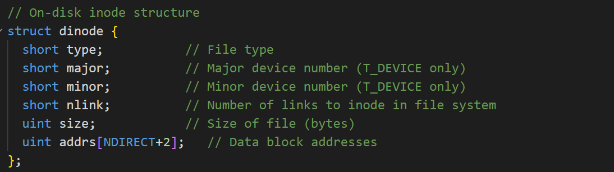
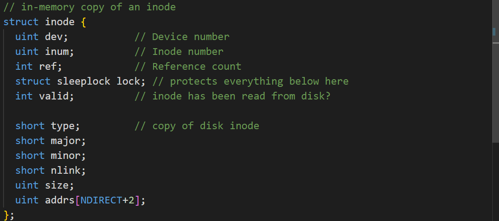
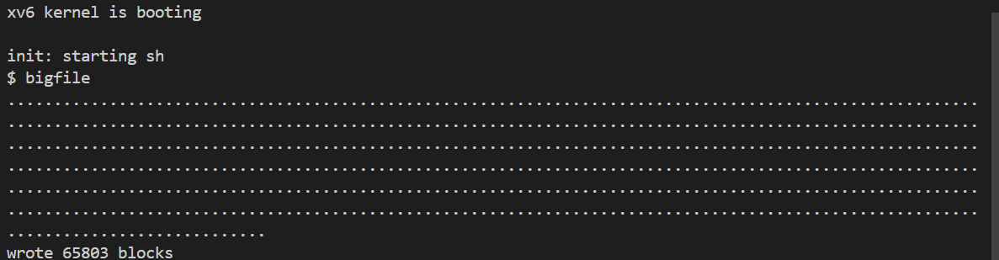
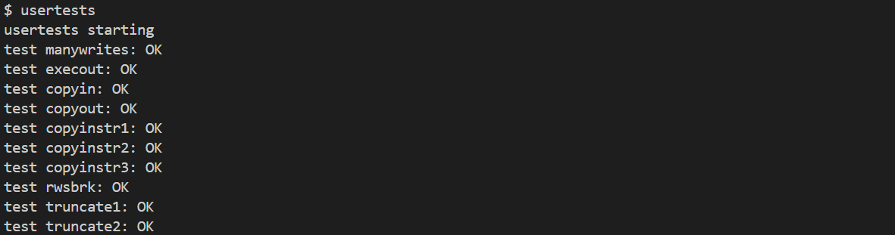
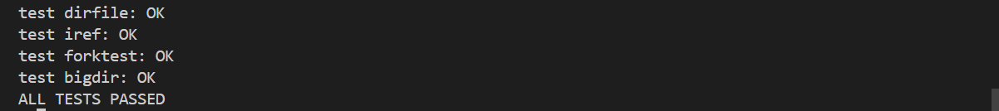
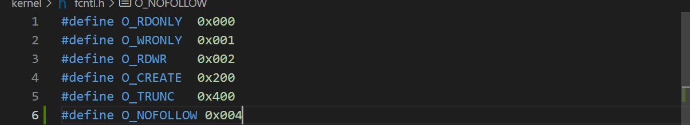
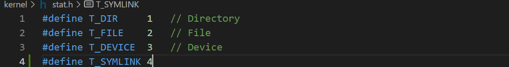
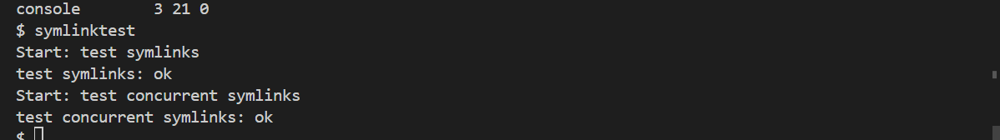
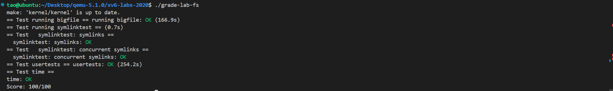

# Lab9：file system

## 1.实验准备

* 在本实验中，您将获得重新设计代码以提高并行性的经验。多核机器上并行性差的一个常见症状是频繁的锁争用。提高并行性通常涉及更改数据结构和锁定策略以减少争用。您将对xv6内存分配器和块缓存执行此操作。

* 切换到`lock`分支：

  ```c
  $ git fetch
  $ git checkout fs
  $ make clean
  ```

## Large files

### 1. 实验内容

* 修改`bmap()`，以便除了直接块和一级间接块之外，它还实现二级间接块。你只需要有11个直接块，而不是12个，为你的新的二级间接块腾出空间；不允许更改磁盘inode的大小。`ip->addrs[]`的前11个元素应该是直接块；第12个应该是一个一级间接块（与当前的一样）；13号应该是你的新二级间接块。当`bigfile`写入65803个块并成功运行`usertests`时，此练习完成。


### 2.实验步骤及代码

* 首先在fs.h中添加宏定义，如下所示：

  ```c
  #define NDIRECT 11
  #define NINDIRECT (BSIZE / sizeof(uint)) //间接块数量
  #define NDINDIRECT ((BSIZE / sizeof(uint)) * (BSIZE / sizeof(uint))) // 二级间接块数量
  #define MAXFILE (NDIRECT + NINDIRECT + NDINDIRECT) // 一个文件最大能够引用的块数量
  #define NADDR_PER_BLOCK (BSIZE / sizeof(uint))  // 一个块中的地址数量
  ```

* 经过上面的定义后，由于`NDIRECT`定义改变，其中一个直接块变为了二级间接块，需要修改inode结构体中`addrs`元素数量，如下：

  

  ​	

* 修改`bmap`让其支持二级索引，代码修改如下：

  ```c
  static uint
  bmap(struct inode *ip, uint bn)
  {
    uint addr, *a;
    struct buf *bp;
  
    if(bn < NDIRECT){
      if((addr = ip->addrs[bn]) == 0)
        ip->addrs[bn] = addr = balloc(ip->dev);
      return addr;
    }
    bn -= NDIRECT;
  
    if(bn < NINDIRECT){
      // Load indirect block, allocating if necessary.
      if((addr = ip->addrs[NDIRECT]) == 0)
        ip->addrs[NDIRECT] = addr = balloc(ip->dev);
      bp = bread(ip->dev, addr);
      a = (uint*)bp->data;
      if((addr = a[bn]) == 0){
        a[bn] = addr = balloc(ip->dev);
        log_write(bp);
      }
      brelse(bp);
      return addr;
    }
    bn -= NDINDIRECT;
    // 二级间接块的情况
    if(bn < NDINDIRECT) {
      int level2_idx = bn / NADDR_PER_BLOCK;  // 要查找的块号位于二级间接块中的位置
      int level1_idx = bn % NADDR_PER_BLOCK;  // 要查找的块号位于一级间接块中的位置
      // 读出二级间接块
      if((addr = ip->addrs[NDIRECT + 1]) == 0)
        ip->addrs[NDIRECT + 1] = addr = balloc(ip->dev);
      bp = bread(ip->dev, addr);
      a = (uint*)bp->data;
  
      if((addr = a[level2_idx]) == 0) {
        a[level2_idx] = addr = balloc(ip->dev);
        // 更改了当前块的内容，标记以供后续写回磁盘
        log_write(bp);
      }
      brelse(bp);
  
      bp = bread(ip->dev, addr);
      a = (uint*)bp->data;
      if((addr = a[level1_idx]) == 0) {
        a[level1_idx] = addr = balloc(ip->dev);
        log_write(bp);
      }
      brelse(bp);
      return addr;
    }
  
    panic("bmap: out of range");
  }
  ```

* 修改`itrunc`释放所有块，代码如下：

  ```c
  void
  itrunc(struct inode *ip)
  {
    int i, j;
    struct buf *bp;
    uint *a;
  
    for(i = 0; i < NDIRECT; i++){
      if(ip->addrs[i]){
        bfree(ip->dev, ip->addrs[i]);
        ip->addrs[i] = 0;
      }
    }
  
    if(ip->addrs[NDIRECT]){
      bp = bread(ip->dev, ip->addrs[NDIRECT]);
      a = (uint*)bp->data;
      for(j = 0; j < NINDIRECT; j++){
        if(a[j])
          bfree(ip->dev, a[j]);
      }
      brelse(bp);
      bfree(ip->dev, ip->addrs[NDIRECT]);
      ip->addrs[NDIRECT] = 0;
    }
  
   struct buf* bp1;
    uint* a1;
    if(ip->addrs[NDIRECT + 1]) {
      bp = bread(ip->dev, ip->addrs[NDIRECT + 1]);
      a = (uint*)bp->data;
      for(i = 0; i < NADDR_PER_BLOCK; i++) {
        // 每个一级间接块的操作都类似于上面的
        // if(ip->addrs[NDIRECT])中的内容
        if(a[i]) {
          bp1 = bread(ip->dev, a[i]);
          a1 = (uint*)bp1->data;
          for(j = 0; j < NADDR_PER_BLOCK; j++) {
            if(a1[j])
              bfree(ip->dev, a1[j]);
          }
          brelse(bp1);
          bfree(ip->dev, a[i]);
        }
      }
      brelse(bp);
      bfree(ip->dev, ip->addrs[NDIRECT + 1]);
      ip->addrs[NDIRECT + 1] = 0;
    }
  
    ip->size = 0;
    iupdate(ip);
  }
  ```

### 3.运行结果

* 启动xv6，输入bigfile，结果如下，成功写入65803个块：
  

* 输入usertests，结果如下，所有测试通过：
  

  

## symbolic links

### 1.实验内容

* 您将实现`symlink(char *target, char *path)`系统调用，该调用在引用由`target`命名的文件的路径处创建一个新的符号链接。有关更多信息，请参阅`symlink`手册页（注：执行`man symlink`）。要进行测试，请将`symlinktest`添加到***Makefile***并运行它。当测试产生以下输出（包括`usertests`运行成功）时，您就完成本作业了。

### 2.实验步骤及代码

* 首先，为`symlink`创建一个新的系统调用号，在***user/usys.pl***、***user/user.h***中添加一个条目，并在***kernel/sysfile.c***中实现一个空的`sys_symlink`。

  

  

* 向***kernel/stat.h***添加新的文件类型（`T_SYMLINK`）以表示符号链接。在k***ernel/fcntl.h***中添加一个新标志（`O_NOFOLLOW`）
  

* 编写`symlink(target, path)`系统调用，代码如下：

  ```c
  // 系统调用 sys_symlink 的实现
  uint64 sys_symlink(void) {
    char target[MAXPATH], path[MAXPATH];
    struct inode* ip_path;
  
    // 从用户空间获取target和path参数，并存储在内核缓冲区中
    if(argstr(0, target, MAXPATH) < 0 || argstr(1, path, MAXPATH) < 0) {
      return -1;
    }
  
    begin_op();  // 开始文件系统操作
  
    // 分配一个新的inode用于符号链接，create返回锁定的inode
    ip_path = create(path, T_SYMLINK, 0, 0);
    if(ip_path == 0) {
      end_op();  // 结束文件系统操作
      return -1; // 如果inode创建失败，返回错误
    }
  
    // 向inode的数据块中写入target路径
    if(writei(ip_path, 0, (uint64)target, 0, MAXPATH) < MAXPATH) {
      iunlockput(ip_path); // 解锁并释放inode
      end_op();            // 结束文件系统操作
      return -1;           // 如果写入失败，返回错误
    }
  
    iunlockput(ip_path); // 解锁并释放inode
    end_op();            // 结束文件系统操作
    return 0;            // 成功返回0
  }
  ```

* 修改`open`系统调用以处理路径指向符号链接的情况。代码如下：

  ```c
      // 处理符号链接
    if(ip->type == T_SYMLINK && !(omode & O_NOFOLLOW)) {
      // 若符号链接指向的仍然是符号链接，则递归的跟随它
      // 直到找到真正指向的文件
      // 但深度不能超过MAX_SYMLINK_DEPTH
      int MAX_SYMLINK_DEPTH = 10;// 递归层数太多
      for(int i = 0; i < MAX_SYMLINK_DEPTH; ++i) {
        // 读出符号链接指向的路径
        if(readi(ip, 0, (uint64)path, 0, MAXPATH) != MAXPATH) {
          iunlockput(ip);
          end_op();
          return -1;
        }
        iunlockput(ip);
        ip = namei(path);
        if(ip == 0) {
          end_op();
          return -1;
        }
        ilock(ip);
        if(ip->type != T_SYMLINK)
          break;
      }
      // 超过最大允许深度后仍然为符号链接，则返回错误
      if(ip->type == T_SYMLINK) {
        iunlockput(ip);
        end_op();
        return -1;
      }
    }
  ```

### 3.运行结果

* 启动xv6，输入命令symlinktest，测试通过，结果如下：
  

## 实验结果

* 启动xv6，输入命令`./grade-lab-fs`，所有测试通过，分数为100/100，结果如下：

  

