# Lab2:System calls

## 实验准备

* Attention

> 在你开始写代码之前，请阅读xv6手册《book-riscv-rev1》的第2章、第4章的第4.3节和第4.4节以及相关源代码文件：
>
> - 系统调用的用户空间代码在***user/user.h***和***user/usys.pl***中。
> - 内核空间代码是***kernel/syscall.h***、***kernel/syscall.c***。
> - 与进程相关的代码是***kernel/proc.h***和***kernel/proc.c***。

* 切换到`syscall`分支：

  ```git
  $ git fetch
  $ git checkout syscall
  $ make clean
  ```

## System call tracing

### 1.实验内容

> 在本作业中，您将添加一个系统调用跟踪功能，该功能可能会在以后调试实验时对您有所帮助。您将创建一个新的`trace`系统调用来控制跟踪。它应该有一个参数，这个参数是一个整数“掩码”（mask），它的比特位指定要跟踪的系统调用。例如，要跟踪`fork`系统调用，程序调用`trace(1 << SYS_fork)`，其中`SYS_fork`是*kernel/syscall.h*中的系统调用编号。如果在掩码中设置了系统调用的编号，则必须修改xv6内核，以便在每个系统调用即将返回时打印出一行。该行应该包含进程id、系统调用的名称和返回值；您不需要打印系统调用参数。`trace`系统调用应启用对调用它的进程及其随后派生的任何子进程的跟踪，但不应影响其他进程。

### 2.示例

```
$ trace 32 grep hello README
3: syscall read -> 1023
3: syscall read -> 966
3: syscall read -> 70
3: syscall read -> 0
$
$ trace 2147483647 grep hello README
4: syscall trace -> 0
4: syscall exec -> 3
4: syscall open -> 3
4: syscall read -> 1023
4: syscall read -> 966
4: syscall read -> 70
4: syscall read -> 0
4: syscall close -> 0
$
$ grep hello README
$
$ trace 2 usertests forkforkfork
usertests starting
test forkforkfork: 407: syscall fork -> 408
408: syscall fork -> 409
409: syscall fork -> 410
410: syscall fork -> 411
409: syscall fork -> 412
410: syscall fork -> 413
409: syscall fork -> 414
411: syscall fork -> 415
...
$
```

### 3.实验过程及代码

* 首先需要在***Makefile***的UPROGS中添加`$U/_trace`，如下所示：

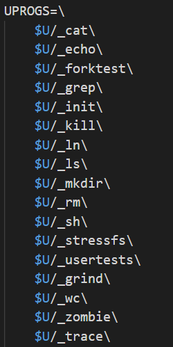

* 由于系统调用的用户空间存根还不存在：将系统调用的原型`int trace(int)`添加到**user/user.h**，如下所示：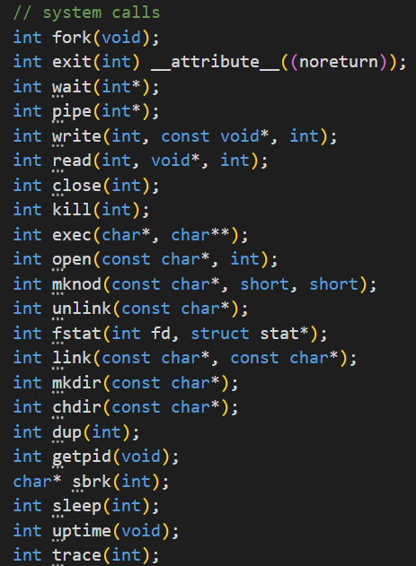
* 将系统调用编号`#define SYS_trace 22`添加到***kernel/syscall.h***，在***user/usys.pl***中添加`entry("trace");`，如下：
  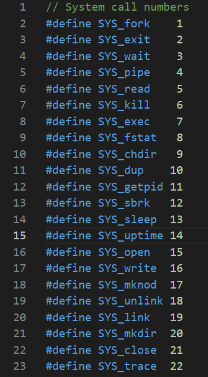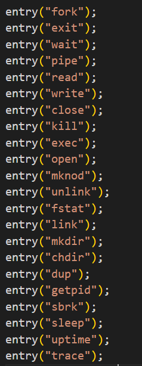
* 在***kernel/sysproc.c***中添加函数`sys_trace()`，该函数将参数保存到`proc`结构体中，如下所示：

```c
//trace program
uint64
sys_trace(void)
{
  return 0;
}
```

即可对系统进行编译运行。

* 其中，`proc`结构体如下：

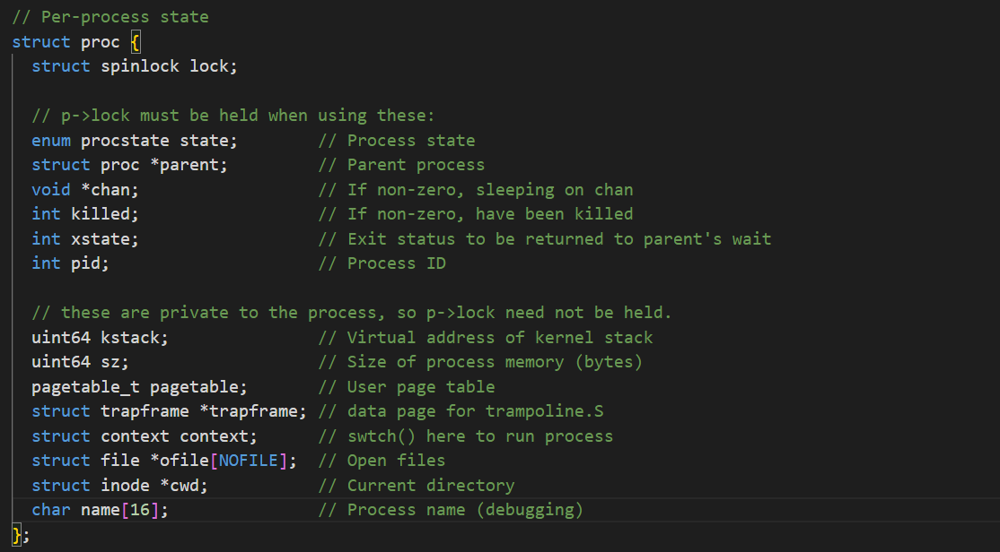

* 查看***kernel/syscall.c***中的`syscall`函数：

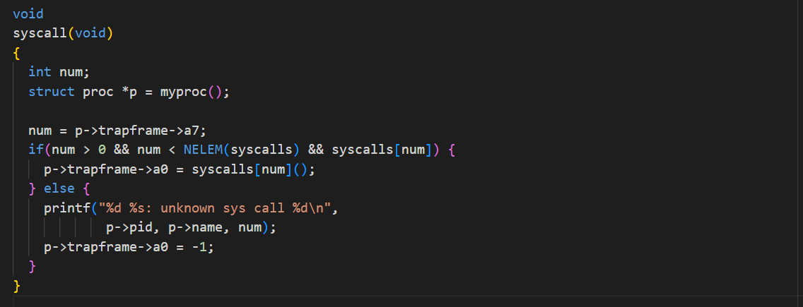

可知，该函数首先用指针`p`获取当前进程的`proc`结构体。从进程的`trapframe`获取系统调用号，存储在寄存器`a7`中。然后检查系统调用号是否在有效范围内，并且是否存在于系统调用表`syscalls`中。如果系统调用存在，则调用相应的系统调用函数，并将返回值存储在进程的`trapframe`结构中的`a0`寄存器中。如果系统调用不存在或者超出了范围，则打印未知系统调用的错误信息，并将返回值设置为 -1。

* 由提示可知，需要获取当前调用函数掩码，可在`proc`结构体中添加`mask`变量对掩码进行存储，如下所示：

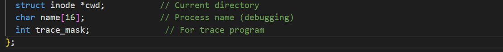

* 然后在`syscall`函数中检查当前系统调用是否在追踪掩码中，如果是，则进行追踪输出。 由于需要打印出系统调用的名称，因此创建一个字符串数组，保存所有系统调用的名称，代码如下：

```c
static char *syscall_names[] = {
  "fork","exit","wait","pipe","read","kill","exec","fstat","chdir","dup","getpid","sbrk","sleep",
  "uptime","open","write","mknod","unlink","link","mkdir","close","trace"
};
```

* `syscall`代码如下：

```c
void
syscall(void)
{
  int num;
  struct proc *p = myproc();

  num = p->trapframe->a7;
  if(num > 0 && num < NELEM(syscalls) && syscalls[num]) {
    p->trapframe->a0 = syscalls[num]();
    int trace_mask = p->trace_mask;
    if ((trace_mask >> num) & 1){
      //打印追踪信息
      printf("%d: syscall %s -> %d\n",p->pid,syscall_names[num - 1],p->trapframe->a0);
    }
  } else {
    printf("%d %s: unknown sys call %d\n",
            p->pid, p->name, num);
    p->trapframe->a0 = -1;
  }
}
```

* 完善`sys_trace`函数，设置当前进程的追踪掩码。代码如下：

```c
//trace program
uint64
sys_trace(void)
{
  int mask;
  if (argint(0,&mask) < 0)
    return -1;
  struct proc *p = myproc();
  p->trace_mask = mask;
  return 0;
}
```

* 由于需要修改`fork`函数，将跟踪掩码从父进程复制到子进程。首先查看`fork`函数，可知该函数首先申请一个新的`proc`指针，然后获取当前进程的`proc`结构体，将结构体中的所有变量的值一一赋给新指针中的变量。仿照复制的代码，添加` np->trace_mask = p->trace_mask;`将父进程的掩码赋给子进程。修改后代码如下：

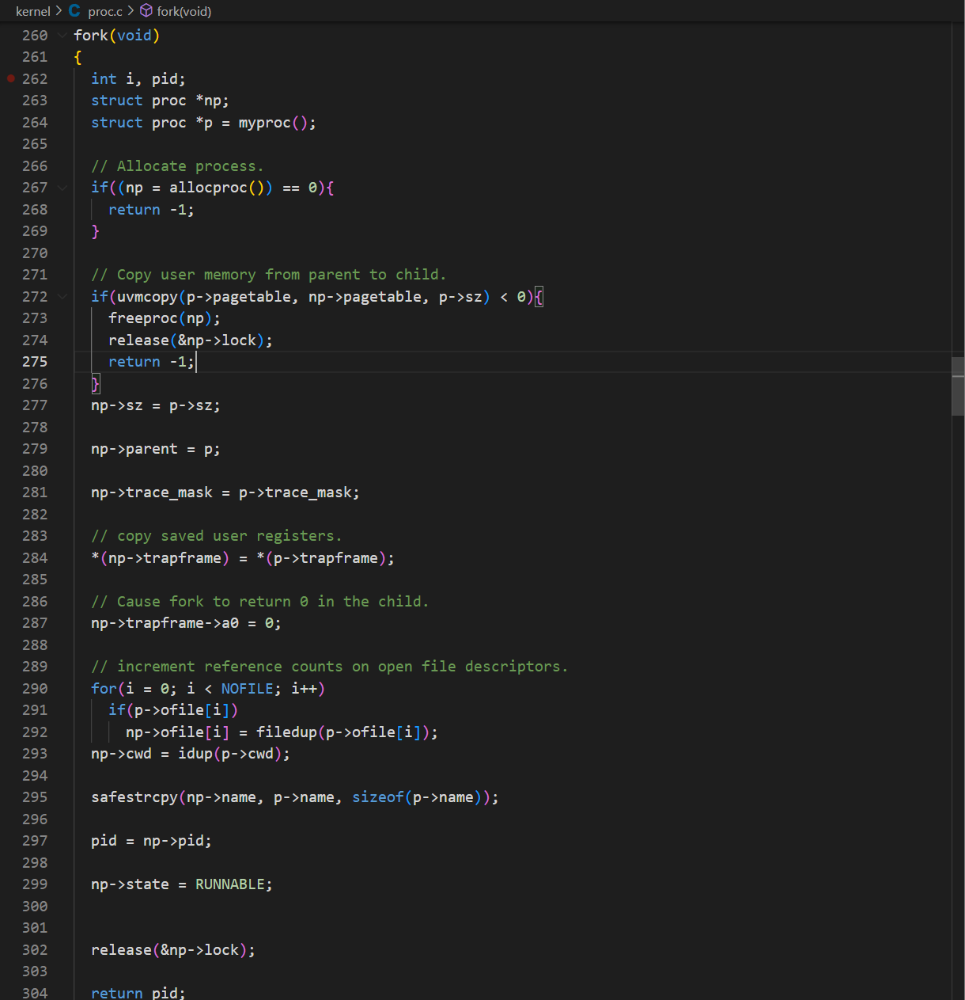

### 4.运行结果

* 输入命令`make qemu`编译运行进入系统，依次输入`trace 32 grep hello README`，`trace 2147483647 grep hello README`，`grep hello README`，`trace 2 usertests forkforkfork`，结果如下，与所给示例程序一致。

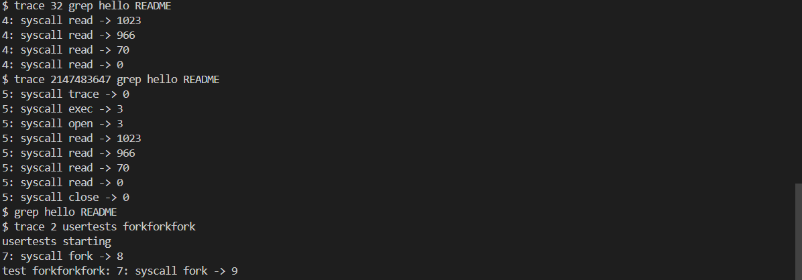

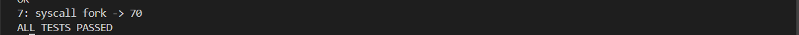

* 退出xv6系统，输入命令`./grade-lab-syscall trace`运行测试，全部通过，结果如下：

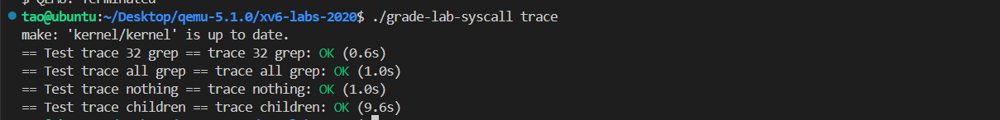

## Sysinfo

### 1.实验内容

> 在这个作业中，您将添加一个系统调用`sysinfo`，它收集有关正在运行的系统的信息。系统调用采用一个参数：一个指向`struct sysinfo`的指针（参见***kernel/sysinfo.h***）。内核应该填写这个结构的字段：`freemem`字段应该设置为空闲内存的字节数，`nproc`字段应该设置为`state`字段不为`UNUSED`的进程数。我们提供了一个测试程序`sysinfotest`；如果输出“**sysinfotest: OK**”则通过。

### 2.实验过程及代码

* 首先在***Makefile***的**UPROGS**中添加`$U/_sysinfotest`
* 然后仿照**System call tracing**实验，添加系统调用编号，系统调用原型和添加`Sysinfo`函数。如下所示：

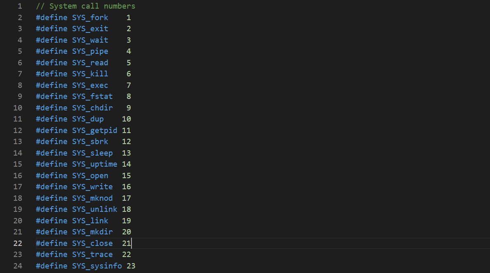

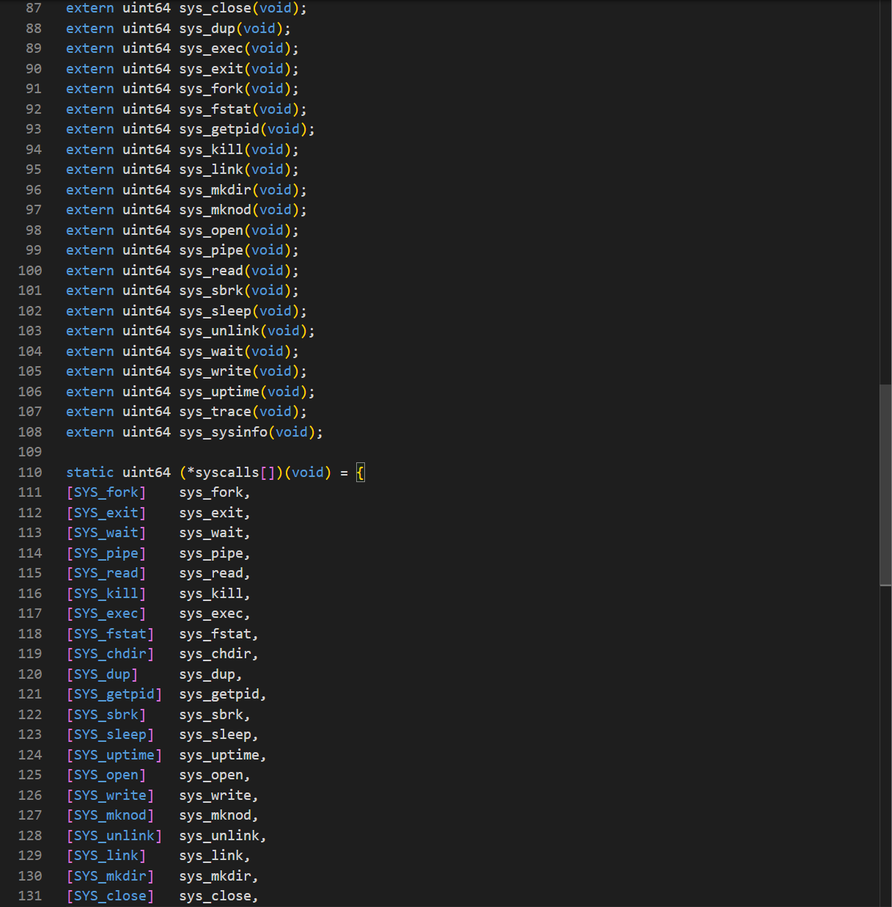

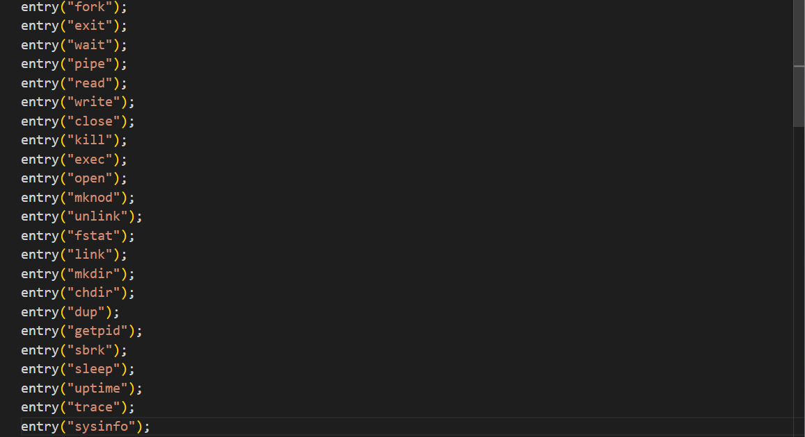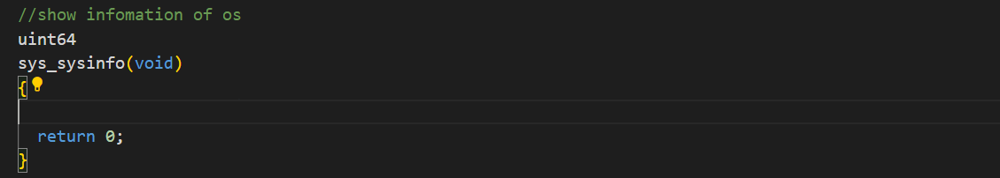

* 其次，需要在声明`struct sysinfo`的存在。在***kernel/sysproc.c***添加`#include "sysinfo.h"`，其中结构体内容如下：

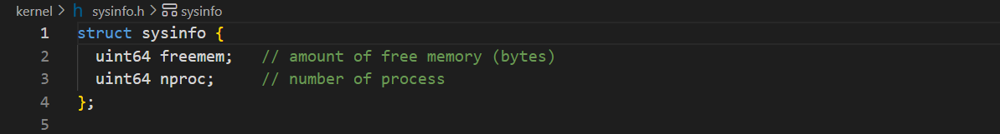


* 根据提示，`sysinfo`需要将一个`struct sysinfo`复制回用户空间。参照`sys_fstat()`(***kernel/sysfile.c***)和`filestat()`(***kernel/file.c***)，使用copyout完成该操作。代码如下：

```c
  if (copyout(myproc()->pagetable, dstaddr, (char *)&info, sizeof info) < 0)return -1;
```

* 在***kernel/kalloc.c***中添加函数`freebytes()`，用于获取空闲内存量。代码如下：

```c
//acquire freemem
void
freebytes(uint64 *dst)
{
  *dst = 0;
  struct run *p = kmem.freelist;
  acquire(&kmem.lock);//获取内存管理的锁
  for (;p;*dst += PGSIZE,p = p->next);//遍历每一个内存块
  release(&kmem.lock);//释放内存管理的锁
}
```

* 在***kernel/proc.c***中添加一个函数`procnum()`，用于获取进程数。代码如下：

```c
//获取处于活跃状态的进程数
void
procnum(uint64 *dst)
{
  *dst = 0;
  struct proc *p;
  for (p = proc;p < &proc[NPROC];p++){
    if (p->state != UNUSED)(*dst)++;
  }
}
```

### 3.运行结果

* 输入命令`make qemu`编译运行进入系统，输入命令`sysinfotest`进行测试，输出“sysinfotest：OK”，通过测试，结果如下。

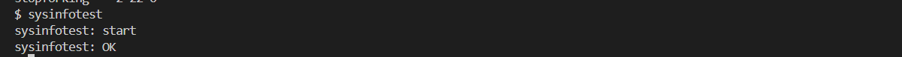

* 退出xv6系统，输入命令`./grade-lab-syscall sysinfo`运行测试，全部通过，结果如下：

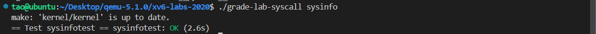

## 实验结果

* 输入命令`./grade-lab-syscall`，对**lab 2**中所有的实验进行测试，全部通过，分数为35/35，如下所示：

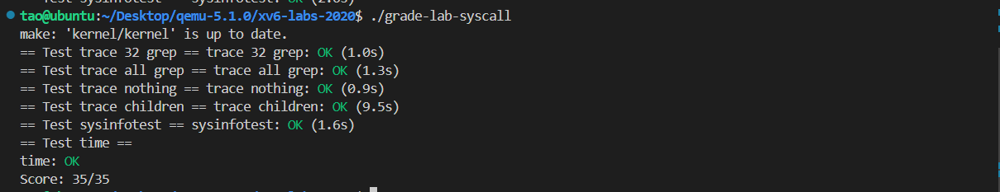
