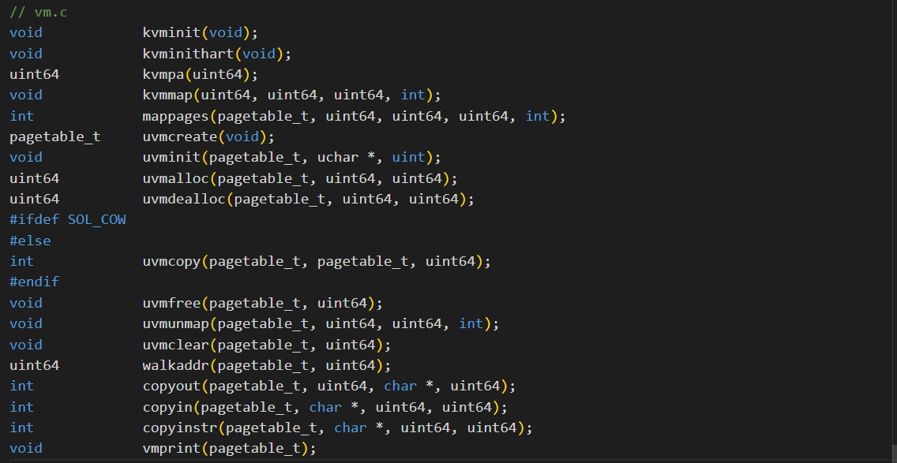
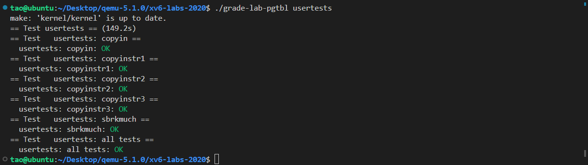
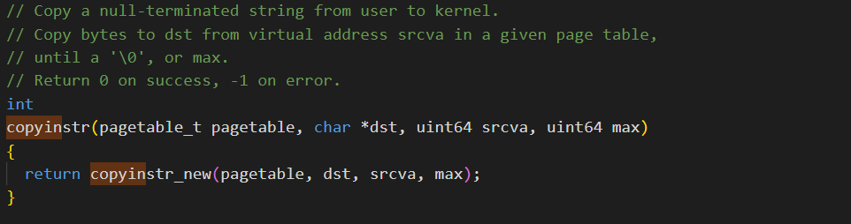

# Lab3: page tables

## 实验准备

==Attention==

> 开始编码之前，请阅读xv6手册的第3章和相关文件：
>
> - ***kernel/memlayout.h***，它捕获了内存的布局。
> - ***kernel/vm.c***，其中包含大多数虚拟内存（VM）代码。
> - ***kernel/kalloc.c***，它包含分配和释放物理内存的代码。

要启动实验，需要切换到pgtbl分支：

```git
$ git fetch
$ git checkout pgtbl
$ make clean
```

## Print a page table

### 1.实验内容

> 定义一个名为`vmprint()`的函数。它应当接收一个`pagetable_t`作为参数，并以下面描述的格式打印该页表。在`exec.c`中的`return argc`之前插入`if(p->pid==1) vmprint(p->pagetable)`，以打印第一个进程的页表。如果你通过了`pte printout`测试的`make grade`，你将获得此作业的满分。

### 2.示例及提示

* 当您启动xv6时，它应该像这样打印输出来描述第一个进程刚刚完成`exec()`ing`init`时的页表：

  ```c
  page table 0x0000000087f6e000
  ..0: pte 0x0000000021fda801 pa 0x0000000087f6a000
  .. ..0: pte 0x0000000021fda401 pa 0x0000000087f69000
  .. .. ..0: pte 0x0000000021fdac1f pa 0x0000000087f6b000
  .. .. ..1: pte 0x0000000021fda00f pa 0x0000000087f68000
  .. .. ..2: pte 0x0000000021fd9c1f pa 0x0000000087f67000
  ..255: pte 0x0000000021fdb401 pa 0x0000000087f6d000
  .. ..511: pte 0x0000000021fdb001 pa 0x0000000087f6c000
  .. .. ..510: pte 0x0000000021fdd807 pa 0x0000000087f76000
  .. .. ..511: pte 0x0000000020001c0b pa 0x0000000080007000
  ```

* 第一行显示`vmprint`的参数。之后的每行对应一个PTE，包含树中指向页表页的PTE。每个PTE行都有一些“`..`”的缩进表明它在树中的深度。每个PTE行显示其在页表页中的PTE索引、PTE比特位以及从PTE提取的物理地址。不要打印无效的PTE。在上面的示例中，顶级页表页具有条目0和255的映射。条目0的下一级只映射了索引0，该索引0的下一级映射了条目0、1和2。

* 您的代码可能会发出与上面显示的不同的物理地址。条目数和虚拟地址应相同。

> 一些提示：
>
> - 你可以将`vmprint()`放在***kernel/vm.c***中
> - 使用定义在***kernel/riscv.h***末尾处的宏
> - 函数`freewalk`可能会对你有所启发
> - 将`vmprint`的原型定义在***kernel/defs.h***中，这样你就可以在`exec.c`中调用它了
> - 在你的`printf`调用中使用`%p`来打印像上面示例中的完成的64比特的十六进制PTE和地址

### 3.实验过程及代码

* 根据提示将`vmprint()`放在***kernel/vm.c***中，原型如下：

  ```c
  // Print a page table
  void
  vmprint(pagetable_t pagetable){
   return 0;
  }
  ```

* 使用定义在***kernel/riscv.h***末尾处的宏，如下所示：
  

* 观察函数`freewalk`，其代码如下：

  ```c
  // Recursively free page-table pages.
  // All leaf mappings must already have been removed.
  void
  freewalk(pagetable_t pagetable)
  {
    // there are 2^9 = 512 PTEs in a page table.
    for(int i = 0; i < 512; i++){
      pte_t pte = pagetable[i];
      if((pte & PTE_V) && (pte & (PTE_R|PTE_W|PTE_X)) == 0){
        // this PTE points to a lower-level page table.
        uint64 child = PTE2PA(pte);
        freewalk((pagetable_t)child);
        pagetable[i] = 0;
      } else if(pte & PTE_V){
        panic("freewalk: leaf");
      }
    }
    kfree((void*)pagetable);
  }
  ```

​	可以看出，该函数通过遍历512个PTE，对于有效的条目，如果没有设置任何权限标志(PTE_R, PTE_W, PTE_X)，则意味着该条目指向着一个较低级别的页表，进而递归调用函数`freewalk`；如果条目有效但是有权限标志被设置，这表明这是一个叶节点条目。

* 仿照函数`freewalk`的逻辑，同样递归调用`vmprint`函数，进而通过递归的深度获取其在树中的深度，从而正确地打印信息。代码如下：

  ```c
  // Print a page table
  void
  _vmprint(pagetable_t pagetable,int depth){
   // there are 2^9 = 512 PTEs in a page table.
      for(int i = 0; i < 512; i++){
          pte_t pte = pagetable[i];
          if (pte & PTE_V){
            for(int j = 0; j < depth; j++){
              if(j)printf(" ");
              printf("..");
            }
            uint64 child = PTE2PA(pte);
            printf("%d: pte %p pa %p\n",i,pte,child);
            if ((pte & (PTE_R|PTE_W|PTE_X)) == 0){
              // this PTE points to a lower-level page table
              _vmprint((pagetable_t)child,depth+1);
            }
          }
      }
  }
  
  // Print parameter of vmprint
  void
  vmprint(pagetable_t pagetable)
  {
    printf("page table %p\n",pagetable);
    _vmprint(pagetable,1);
  }
  ```

* 将`vmprint`的原型定义在***kernel/defs.h***中，以至于能够在`exec.c`中调用它。



* 最后在`exec.c`中的`return argc`之前插入`if(p->pid==1) vmprint(p->pagetable)`，以打印第一个进程的页表。


### 4.运行结果

* 在命令行输入`./grade-lab-pgtbl pte printout`，进行测试，测试通过，结果如下：


## A kernel page table per proce

### 1.实验内容

> 你的第一项工作是修改内核来让每一个进程在内核中执行时使用它自己的内核页表的副本。修改`struct proc`来为每一个进程维护一个内核页表，修改调度程序使得切换进程时也切换内核页表。对于这个步骤，每个进程的内核页表都应当与现有的的全局内核页表完全一致。如果你的`usertests`程序正确运行了，那么你就通过了这个实验。

### 2.提示

> - 在`struct proc`中为进程的内核页表增加一个字段
> - 为一个新进程生成一个内核页表的合理方案是实现一个修改版的`kvminit`，这个版本中应当创造一个新的页表而不是修改`kernel_pagetable`。你将会考虑在`allocproc`中调用这个函数
> - 确保每一个进程的内核页表都关于该进程的内核栈有一个映射。在未修改的XV6中，所有的内核栈都在`procinit`中设置。你将要把这个功能部分或全部的迁移到`allocproc`中
> - 修改`scheduler()`来加载进程的内核页表到核心的`satp`寄存器(参阅`kvminithart`来获取启发)。不要忘记在调用完`w_satp()`后调用`sfence_vma()`
> - 没有进程运行时`scheduler()`应当使用`kernel_pagetable`
> - 在`freeproc`中释放一个进程的内核页表
> - 你需要一种方法来释放页表，而不必释放叶子物理内存页面。
> - 调式页表时，也许`vmprint`能派上用场
> - 修改XV6本来的函数或新增函数都是允许的；你或许至少需要在***kernel/vm.c***和***kernel/proc.c***中这样做（但不要修改***kernel/vmcopyin.c***, ***kernel/stats.c***, ***user/usertests.c***, 和***user/stats.c***）
> - 页表映射丢失很可能导致内核遭遇页面错误。这将导致打印一段包含`sepc=0x00000000XXXXXXXX`的错误提示。你可以在***kernel/kernel.asm\***通过查询`XXXXXXXX`来定位错误。

### 3.实验过程及代码

* 首先在`struct proc`中为进程添加一个字段，用于访问进程自己的内核页表：


* 仿照`kvminit`新建一个函数`kptinit`，用于为一个新进程生成一个内核页表。函数`kptinit`的代码如下：

  ```c
  // Create a kernel page for a process
  pagetable_t
  proc_kptinit()
  {
    pagetable_t kpagetable = uvmcreate();
    if(kpagetable == 0)return 0;
  
    // uart registers
    uvmmap(kpagetable, UART0, UART0, PGSIZE, PTE_R | PTE_W);
  
    // virtio mmio disk interface
    uvmmap(kpagetable, VIRTIO0, VIRTIO0, PGSIZE, PTE_R | PTE_W);
  
    // CLINT
    uvmmap(kpagetable, CLINT, CLINT, 0x10000, PTE_R | PTE_W);
  
    // PLIC
    uvmmap(kpagetable, PLIC, PLIC, 0x400000, PTE_R | PTE_W);
  
    // map kernel text executable and read-only.
    uvmmap(kpagetable, KERNBASE, KERNBASE, (uint64)etext-KERNBASE, PTE_R | PTE_X);
  
    // map kernel data and the physical RAM we'll make use of.
    uvmmap(kpagetable, (uint64)etext, (uint64)etext, PHYSTOP-(uint64)etext, PTE_R | PTE_W);
  
    // map the trampoline for trap entry/exit to
    // the highest virtual address in the kernel.
    uvmmap(kpagetable, TRAMPOLINE, (uint64)trampoline, PGSIZE, PTE_R | PTE_X);
    return kpagetable;
  }
  ```
  
	先仿照`kvmmap`函数创建函数`uvmmap`，用于将进程的内核页表进行映射，代码如下：
  
  ```c
  // Just follow the kvmmap on vm.c
  void
  uvmmap(pagetable_t pagetable, uint64 va, uint64 pa, uint64 sz, int perm)
  {
    if(mappages(pagetable, va, sz, pa, perm) != 0)
      panic("uvmmap");
  }
  ```
  
* 观察函数`allocproc`，如下：


​	在分配一个新的用户页表给进程的代码片段后，在此调用`kptinit`函数，新建一个进程的内核页表，如下所示：


* 为了确保每一个进程的内核页表都关于该进程的内核栈有一个映射。将`procinit`函数中关于内核栈设置的代码段迁移到`allocproc`函数中，如下所示：


* 修改函数`scheduler()`来加载进程的内核页表到核心的`stap`寄存器中，观察函数`kvminithart`，其代码如下：


​	仿照上面的代码，新建函数`kptinithart`如下：

```c
// Load the kernel page table of the process into the core's SATP register.
void
proc_kptinithart(pagetable_t kpagetable)
{
  w_satp(MAKE_SATP(kpagetable));
  sfence_vma();
}
```

​	接着修改`scheduler`函数，在进程被调度进行运行时，调用该函数 ，如下所示：


* 修改函数`freeproc`，使其在释放进程时同时也释放进程的内核页表，但不需要释放叶子物理内存页面。仿照函数`vmprint`中的逻辑，访问每一个进程的页表。创建函数`proc_freepagetable`，代码如下：

  ```c
  // Free kernel of proc
  void
  proc_freekpagetable(pagetable_t kpagetable)
  {
    // there are 2^9 = 512 PTEs in a page table.
      for(int i = 0; i < 512; i++){
          pte_t pte = kpagetable[i];
          if (pte & PTE_V){
            kpagetable[i] = 0;
            uint64 child = PTE2PA(pte);
            if ((pte & (PTE_R|PTE_W|PTE_X)) == 0){
              // this PTE points to a lower-level page table
              proc_freekpagetable((pagetable_t)child);
            }
          }
      }
      kfree((void*)kpagetable);
  }
  ```

  在`freeproc`中调用该函数，并且释放相应的内核栈，如下所示：

  

* 将新创建的函数定义添加到***kernel/defs.h***，如下所示：


* 最后修改***kernal/vm.c***中的函数`kvmpa`，使其使用进程的内核页表，如下所示：


### 4.运行结果

* 输入命令`./grade-lab-pgtbl usertests`，测试全部通过，如下所示：



## Simplify copy/ copyinstr

### 1.实验内容

> 将定义在***kernel/vm.c***中的`copyin`的主题内容替换为对`copyin_new`的调用（在***kernel/vmcopyin.c***中定义）；对`copyinstr`和`copyinstr_new`执行相同的操作。为每个进程的内核页表添加用户地址映射，以便`copyin_new`和`copyinstr_new`工作。如果`usertests`正确运行并且所有`make grade`测试都通过，那么你就完成了此项作业。

### 2.示例及提示

* 一些提示：

> * 先用对`copyin_new`的调用替换`copyin()`，确保正常工作后再去修改`copyinstr`
> * 在内核更改进程的用户映射的每一处，都以相同的方式更改进程的内核页表。包括`fork()`, `exec()`, 和`sbrk()`.
> * 不要忘记在`userinit`的内核页表中包含第一个进程的用户页表
> * 用户地址的PTE在进程的内核页表中需要什么权限？(在内核模式下，无法访问设置了`PTE_U`的页面）
> * 别忘了上面提到的PLIC限制

### 3.实验过程及代码

* 根据提示首先修改`copyin()`和`copyinstr()`函数，在内部调用事先准备好的`copyin_new()`和`copyinstr_new()`函数。如下所示：
  

  接着在***kernel/defs.h***中添加对应函数声明，如下所示：
  

* 修改内核更改进程的用户映射的每一处，首先修改`fork()`函数，如下所示：

  ```c
    // 将进程页表的mapping，复制一份到进程内核页表
    for (j = 0;j < p->sz; j+=PGSIZE){
      pte = walk(np->pagetable, j, 0);
      kernelPte = walk(np->kpagetable, j, 1);
      *kernelPte = (*pte) & ~PTE_U;
    }
  ```

  这段代码通过`walk()`函数访问`np`的页表，查找虚拟地址对应的PTE，然后合区内核页表页表条目，最后及那个用户级页表条目复制到内核页表条目。

* 同理，根据上面对`fork()`函数的修改，对`exec()`进行修改，添加如下代码：

  ```c
    pte_t *pte, *kernelPte;
    // 释放进程旧内核页表映射
    uvmunmap(p->kpagetable, 0, PGROUNDUP(oldsz)/PGSIZE,0);
    // 将进程页表的mapping，复制一份到进程内核页表
    for (int j = 0;j < sz;j += PGSIZE){
      pte = walk(pagetable, j, 0);
      kernelPte = walk(p->kpagetable, j, 1);
      *kernelPte = (*pte) & ~PTE_U;
    }
  ```

  并按照提示添加用户地址空间不能大于PLIC的判断：

  ```c
    // Load program into memory.
  	// ~
      if (sz1 >= PLIC){
        goto bad;
      }
  	// ~
    }
  ```

* 对`sbrk()`进行修改，添加如下代码段：

  ```c
    if (n > 0){
      for (j = addr; j <addr +n; j += PGSIZE){
        pte = walk(p->pagetable, j, 0);
        kernelPte = walk(p->kpagetable, j, 1);
        *kernelPte = (*pte) & ~PTE_U;
      }
    }else {
      for (j = addr - PGSIZE; j >= addr + n; j -=PGSIZE){
        uvmunmap(p->kpagetable, j, 1, 0);
      }
    }
  ```

  在内存进行扩张时，将一系列页面从用户模式转换为只能被内核访问；当内存进行缩小时，解除一定范围内的页面映射，但不删除底层物理页面也不清空其内容。

* 修改`userinit()`函数，修改逻辑与`fork()`中的修改逻辑相同：

  ```c
    // 复制一份到内核页表
    pte = walk(p->pagetable, 0, 0);
    kernelPte = walk(p->kpagetable, 0, 1);
    *kernelPte = (*pte) & ~PTE_U;
  ```

### 4.运行结果

* 在命令行输入`./grade-lab-pgtbl usertests`，进行测试，测试通过，结果如下：

  

## 实验结果

* 在命令行中输入`./grade-lab-pgtbl`命令，所有测试通过，分数为66/66，如下所示：


