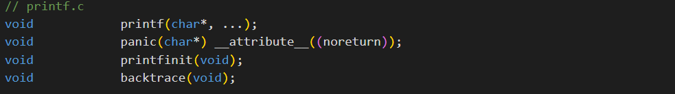
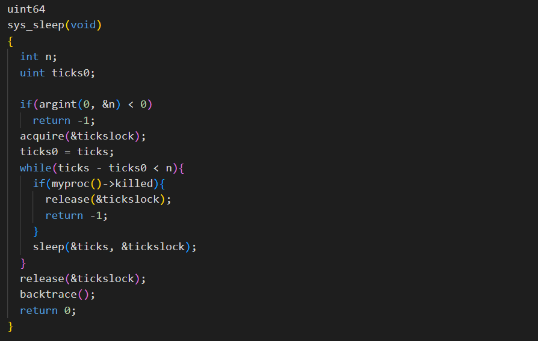
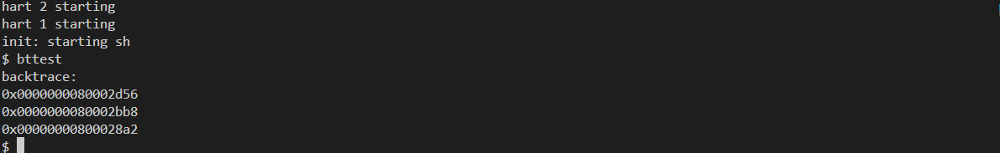
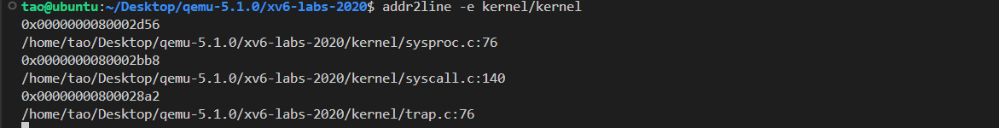
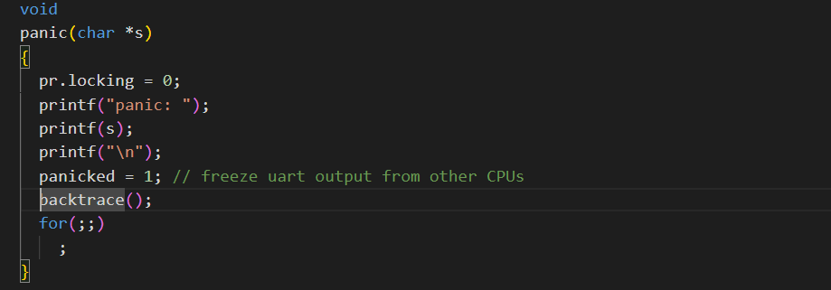

# Lab4: traps

## 1.实验准备

* 本实验探索如何使用陷阱实现系统调用。您将首先使用栈做一个热身练习，然后实现一个用户级陷阱处理的示例。

* ==Attention==

> 开始编码之前，请阅读xv6手册的第4章和相关源文件：
>
> - ***kernel/trampoline.S***：涉及从用户空间到内核空间再到内核空间的转换的程序集
> - ***kernel/trap.c***：处理所有中断的代码

* 切换到`traps`分支：

  ```c
  $ git fetch
  $ git checkout traps
  $ make clean
  ```

## RISC-V assembly

### 1. 实验内容

* 理解一点RISC-V汇编是很重要的，你应该在6.004中接触过。xv6仓库中有一个文件***user/call.c***。执行`make fs.img`编译它，并在***user/call.asm***中生成可读的汇编版本。

* 阅读***call.asm***中函数`g`、`f`和`main`的代码。以下是您应该回答的一些问题（将答案存储在***answers-traps.txt***文件中）：

  > 1. 哪些寄存器保存函数的参数？例如，在`main`对`printf`的调用中，哪个寄存器保存13？
  >
  > 2. `main`的汇编代码中对函数`f`的调用在哪里？对`g`的调用在哪里(提示：编译器可能会将函数内联）
  >
  > 3. `printf`函数位于哪个地址？
  >
  > 4. 在`main`中`printf`的`jalr`之后的寄存器`ra`中有什么值？
  >
  > 5. 运行以下代码。
  >
  >    ```c
  >    unsigned int i = 0x00646c72;
  >    printf("H%x Wo%s", 57616, &i);
  >    ```
  >
  >    程序的输出是什么？这是将字节映射到字符的[ASCII码表](http://web.cs.mun.ca/~michael/c/ascii-table.html)。
  >
  >    输出取决于RISC-V小端存储的事实。如果RISC-V是大端存储，为了得到相同的输出，你会把`i`设置成什么？是否需要将`57616`更改为其他值？
  >
  >    [这里有一个小端和大端存储的描述](http://www.webopedia.com/TERM/b/big_endian.html)和一个[更异想天开的描述](http://www.networksorcery.com/enp/ien/ien137.txt)。
  >
  >    在下面的代码中，“`y=`”之后将打印什么(注：答案不是一个特定的值）？为什么会发生这种情况？
  >
  >    ```c
  >    printf("x=%d y=%d", 3);
  >    ```

### 2.实验步骤及代码

* 按照题目创建***answers-traps.txt***文件。

* 首先阅读***call.asm***中函数`g`、`f`和`main`的代码：

  ```assembly
  // 函数g的代码
  int g(int x) {
     0:	1141                	addi	sp,sp,-16
     2:	e422                	sd	s0,8(sp)
     4:	0800                	addi	s0,sp,16
    return x+3;
  }
  ```

  ```assembly
  // 函数f的代码
  int f(int x) {
     e:	1141                	addi	sp,sp,-16
    10:	e422                	sd	s0,8(sp)
    12:	0800                	addi	s0,sp,16
    return g(x);
  }
  ```

  ```assembly
  // 函数main的代码
  void main(void) {
    1c:	1141                	addi	sp,sp,-16
    1e:	e406                	sd	ra,8(sp)
    20:	e022                	sd	s0,0(sp)
    22:	0800                	addi	s0,sp,16
    printf("%d %d\n", f(8)+1, 13);
    24:	4635                	li	a2,13
    26:	45b1                	li	a1,12
    28:	00000517          	auipc	a0,0x0
    2c:	7b050513          	addi	a0,a0,1968 # 7d8 <malloc+0xea>
    30:	00000097          	auipc	ra,0x0
    34:	600080e7          	jalr	1536(ra) # 630 <printf>
    exit(0);
    38:	4501                	li	a0,0
    3a:	00000097          	auipc	ra,0x0
    3e:	27e080e7          	jalr	638(ra) # 2b8 <exit>
  ```


## 实验结果
* 对于题目1：

  >  答：在a0~a7中存放参数，13存放在a2中。

* 对于题目2：

  > 答：可以看到汇编代码中并没有直接跳转到对于的调用函数起始地址进行执行，说明`main`函数进行了内联优化处理，从代码`li a1,12`可以看出，main直接计算出了结果并储存。

* 对于题目3：

  > 答：由生成的汇编语言中的这一句代码`0000000000000630 <printf>:`可知：`printf`函数位于0x630。

* 对于题目4：

  > 答：ra中保存的是0x30，加上0x600后为0x630，即`printf`的地址，执行此行代码后，将跳转到printf函数执行，并将PC+4=0X34+0X4=0X38保存到`ra`中，供之后返回使用。

* 对于题目5：

  > 答：57616=0xE110，0x00646c72小端存储为72-6c-64-00，对照ASCII码表72:r 6c:l 64:d 00:充当字符串结尾标识，因此输出为：HE110 World。若为大端存储，i应改为0x726c6400，不需改变57616。原本需要两个参数，却只传入了一个，因此y=后面打印的结果取决于之前a2中保存的数据。
  
  

## Backtrace

### 1.实验内容

* **回溯(Backtrace)**通常对于调试很有用：它是一个存放于栈上用于指示错误发生位置的函数调用列表。

* 在***kernel/printf.c***中实现名为`backtrace()`的函数。在`sys_sleep`中插入一个对此函数的调用，然后运行`bttest`，它将会调用`sys_sleep`。你的输出应该如下所示：

  ```c
  backtrace:
  0x0000000080002cda
  0x0000000080002bb6
  0x0000000080002898
  ```

* 在`bttest`退出qemu后。在你的终端：地址或许会稍有不同，但如果你运行`addr2line -e kernel/kernel`（或`riscv64-unknown-elf-addr2line -e kernel/kernel`），并将上面的地址剪切粘贴如下：

  ```c
  $ addr2line -e kernel/kernel
  0x0000000080002de2
  0x0000000080002f4a
  0x0000000080002bfc
  Ctrl-D
  ```

  你应该看到类似下面的输出：

  ```c
  kernel/sysproc.c:74
  kernel/syscall.c:224
  kernel/trap.c:85
  ```

### 2.提示

* 在***kernel/defs.h***中添加`backtrace`的原型，那样你就能在`sys_sleep`中引用`backtrace`

* GCC编译器将当前正在执行的函数的帧指针保存在`s0`寄存器，将下面的函数添加到***kernel/riscv.h***

  ```c
  static inline uint64
  r_fp()
  {
    uint64 x;
    asm volatile("mv %0, s0" : "=r" (x) );
    return x;
  }
  ```

  并在`backtrace`中调用此函数来读取当前的帧指针。这个函数使用[内联汇编](https://gcc.gnu.org/onlinedocs/gcc/Using-Assembly-Language-with-C.html)来读取`s0`。

* 这个[课堂笔记](https://pdos.csail.mit.edu/6.828/2020/lec/l-riscv-slides.pdf)中有张栈帧布局图。注意返回地址位于栈帧帧指针的固定偏移(-8)位置，并且保存的帧指针位于帧指针的固定偏移(-16)位置。
  

* XV6在内核中以页面对齐的地址为每个栈分配一个页面。你可以通过`PGROUNDDOWN(fp)`和`PGROUNDUP(fp)`（参见***kernel/riscv.h***）来计算栈页面的顶部和底部地址。这些数字对于`backtrace`终止循环是有帮助的。

* 一旦你的`backtrace`能够运行，就在***kernel/printf.c\***的`panic`中调用它，那样你就可以在`panic`发生时看到内核的`backtrace`。

### 3.实验步骤及代码

* 根据提示，首先在***kernel/defs.h***中添加`backtrace`的原型，如下所示：
  

* 接着将要求的函数添加到***kernel/riscv.h***中，如下所示：
  

* 编写`backtrace()`函数如下：

  ```c
  // print fun of stack
  void
  backtrace()
  {
    printf("backtrace:\n");
    // get the fp of current proc
    uint64 fp = r_fp();
    uint64 *frame = (uint64 *) fp;
    // compute limitation of stack
    uint64 up = PGROUNDUP(fp);
    uint64 down = PGROUNDDOWN(fp);
    // traverse each stack to print the return address
    while (fp < up &&  fp > down){
      printf("%s\n",frame[-1]);
      fp = frame[-2];
      frame = (uint64 *) fp;
    }
  }
  ```

  该函数主要通过调用`r_fp()`函数获取当前正在执行的函数栈指针，通过该栈指针进行遍历，由提示可知，在栈指针向下偏移8个比特的位置是该函数的返回地址，向下偏移16个比特的位置是调用该函数的函数栈帧指针。通过获得的栈帧上下限控制循环，从而完成遍历。

* 在`sys_sleep`插入对`backtrace()`的调用，如下所示：
  

### 3.运行结果

* 进入xv6系统，运行`bttest`，效果如下：
  

* 运行`addr2line -e kernel/kernel`，并将上面的地址剪切粘贴如下：
  

  与示例一致。

* 在***kernel/printf.c***的`panic`中调用`backtrace()`，如下所示：
  

