# Lab4: traps

## 1.实验准备

* 本实验探索如何使用陷阱实现系统调用。您将首先使用栈做一个热身练习，然后实现一个用户级陷阱处理的示例。

* ==Attention==

> 开始编码之前，请阅读xv6手册的第4章和相关源文件：
>
> - ***kernel/trampoline.S***：涉及从用户空间到内核空间再到内核空间的转换的程序集
> - ***kernel/trap.c***：处理所有中断的代码

* 切换到`traps`分支：

  ```c
  $ git fetch
  $ git checkout traps
  $ make clean
  ```

## RISC-V assembly

### 1. 实验内容

* 理解一点RISC-V汇编是很重要的，你应该在6.004中接触过。xv6仓库中有一个文件***user/call.c***。执行`make fs.img`编译它，并在***user/call.asm***中生成可读的汇编版本。

* 阅读***call.asm***中函数`g`、`f`和`main`的代码。以下是您应该回答的一些问题（将答案存储在***answers-traps.txt***文件中）：

  > 1. 哪些寄存器保存函数的参数？例如，在`main`对`printf`的调用中，哪个寄存器保存13？
  >
  > 2. `main`的汇编代码中对函数`f`的调用在哪里？对`g`的调用在哪里(提示：编译器可能会将函数内联）
  >
  > 3. `printf`函数位于哪个地址？
  >
  > 4. 在`main`中`printf`的`jalr`之后的寄存器`ra`中有什么值？
  >
  > 5. 运行以下代码。
  >
  >    ```c
  >    unsigned int i = 0x00646c72;
  >    printf("H%x Wo%s", 57616, &i);
  >    ```
  >
  >    程序的输出是什么？这是将字节映射到字符的[ASCII码表](http://web.cs.mun.ca/~michael/c/ascii-table.html)。
  >
  >    输出取决于RISC-V小端存储的事实。如果RISC-V是大端存储，为了得到相同的输出，你会把`i`设置成什么？是否需要将`57616`更改为其他值？
  >
  >    [这里有一个小端和大端存储的描述](http://www.webopedia.com/TERM/b/big_endian.html)和一个[更异想天开的描述](http://www.networksorcery.com/enp/ien/ien137.txt)。
  >
  >    在下面的代码中，“`y=`”之后将打印什么(注：答案不是一个特定的值）？为什么会发生这种情况？
  >
  >    ```c
  >    printf("x=%d y=%d", 3);
  >    ```

### 2.实验步骤及代码

* 按照题目创建***answers-traps.txt***文件。

* 首先阅读***call.asm***中函数`g`、`f`和`main`的代码：

  ```assembly
  // 函数g的代码
  int g(int x) {
     0:	1141                	addi	sp,sp,-16
     2:	e422                	sd	s0,8(sp)
     4:	0800                	addi	s0,sp,16
    return x+3;
  }
  ```

  ```assembly
  // 函数f的代码
  int f(int x) {
     e:	1141                	addi	sp,sp,-16
    10:	e422                	sd	s0,8(sp)
    12:	0800                	addi	s0,sp,16
    return g(x);
  }
  ```

  ```assembly
  // 函数main的代码
  void main(void) {
    1c:	1141                	addi	sp,sp,-16
    1e:	e406                	sd	ra,8(sp)
    20:	e022                	sd	s0,0(sp)
    22:	0800                	addi	s0,sp,16
    printf("%d %d\n", f(8)+1, 13);
    24:	4635                	li	a2,13
    26:	45b1                	li	a1,12
    28:	00000517          	auipc	a0,0x0
    2c:	7b050513          	addi	a0,a0,1968 # 7d8 <malloc+0xea>
    30:	00000097          	auipc	ra,0x0
    34:	600080e7          	jalr	1536(ra) # 630 <printf>
    exit(0);
    38:	4501                	li	a0,0
    3a:	00000097          	auipc	ra,0x0
    3e:	27e080e7          	jalr	638(ra) # 2b8 <exit>
  ```


## 实验结果
* 对于题目1：

  >  答：在a0~a7中存放参数，13存放在a2中。

* 对于题目2：

  > 答：可以看到汇编代码中并没有直接跳转到对于的调用函数起始地址进行执行，说明`main`函数进行了内联优化处理，从代码`li a1,12`可以看出，main直接计算出了结果并储存。

* 对于题目3：

  > 答：由生成的汇编语言中的这一句代码`0000000000000630 <printf>:`可知：`printf`函数位于0x630。

* 对于题目4：

  > 答：ra中保存的是0x30，加上0x600后为0x630，即`printf`的地址，执行此行代码后，将跳转到printf函数执行，并将PC+4=0X34+0X4=0X38保存到`ra`中，供之后返回使用。

* 对于题目5：

  > 答：57616=0xE110，0x00646c72小端存储为72-6c-64-00，对照ASCII码表72:r 6c:l 64:d 00:充当字符串结尾标识，因此输出为：HE110 World。若为大端存储，i应改为0x726c6400，不需改变57616。原本需要两个参数，却只传入了一个，因此y=后面打印的结果取决于之前a2中保存的数据。
  
  

## Backtrace

### 1.实验内容

* **回溯(Backtrace)**通常对于调试很有用：它是一个存放于栈上用于指示错误发生位置的函数调用列表。

* 在***kernel/printf.c***中实现名为`backtrace()`的函数。在`sys_sleep`中插入一个对此函数的调用，然后运行`bttest`，它将会调用`sys_sleep`。你的输出应该如下所示：

  ```c
  backtrace:
  0x0000000080002cda
  0x0000000080002bb6
  0x0000000080002898
  ```

* 在`bttest`退出qemu后。在你的终端：地址或许会稍有不同，但如果你运行`addr2line -e kernel/kernel`（或`riscv64-unknown-elf-addr2line -e kernel/kernel`），并将上面的地址剪切粘贴如下：

  ```c
  $ addr2line -e kernel/kernel
  0x0000000080002de2
  0x0000000080002f4a
  0x0000000080002bfc
  Ctrl-D
  ```

  你应该看到类似下面的输出：

  ```c
  kernel/sysproc.c:74
  kernel/syscall.c:224
  kernel/trap.c:85
  ```

### 2.提示

* 在***kernel/defs.h***中添加`backtrace`的原型，那样你就能在`sys_sleep`中引用`backtrace`

* GCC编译器将当前正在执行的函数的帧指针保存在`s0`寄存器，将下面的函数添加到***kernel/riscv.h***

  ```c
  static inline uint64
  r_fp()
  {
    uint64 x;
    asm volatile("mv %0, s0" : "=r" (x) );
    return x;
  }
  ```

  并在`backtrace`中调用此函数来读取当前的帧指针。这个函数使用[内联汇编](https://gcc.gnu.org/onlinedocs/gcc/Using-Assembly-Language-with-C.html)来读取`s0`。

* 这个[课堂笔记](https://pdos.csail.mit.edu/6.828/2020/lec/l-riscv-slides.pdf)中有张栈帧布局图。注意返回地址位于栈帧帧指针的固定偏移(-8)位置，并且保存的帧指针位于帧指针的固定偏移(-16)位置。
  

* XV6在内核中以页面对齐的地址为每个栈分配一个页面。你可以通过`PGROUNDDOWN(fp)`和`PGROUNDUP(fp)`（参见***kernel/riscv.h***）来计算栈页面的顶部和底部地址。这些数字对于`backtrace`终止循环是有帮助的。

* 一旦你的`backtrace`能够运行，就在***kernel/printf.c***的`panic`中调用它，那样你就可以在`panic`发生时看到内核的`backtrace`。

### 3.实验步骤及代码

* 根据提示，首先在***kernel/defs.h***中添加`backtrace`的原型，如下所示：
  

* 接着将要求的函数添加到***kernel/riscv.h***中，如下所示：
  

* 编写`backtrace()`函数如下：

  ```c
  // print fun of stack
  void
  backtrace()
  {
    printf("backtrace:\n");
    // get the fp of current proc
    uint64 fp = r_fp();
    uint64 *frame = (uint64 *) fp;
    // compute limitation of stack
    uint64 up = PGROUNDUP(fp);
    uint64 down = PGROUNDDOWN(fp);
    // traverse each stack to print the return address
    while (fp < up &&  fp > down){
      printf("%s\n",frame[-1]);
      fp = frame[-2];
      frame = (uint64 *) fp;
    }
  }
  ```

  该函数主要通过调用`r_fp()`函数获取当前正在执行的函数栈指针，通过该栈指针进行遍历，由提示可知，在栈指针向下偏移8个比特的位置是该函数的返回地址，向下偏移16个比特的位置是调用该函数的函数栈帧指针。通过获得的栈帧上下限控制循环，从而完成遍历。

* 在`sys_sleep`插入对`backtrace()`的调用，如下所示：
  

### 3.运行结果

* 进入xv6系统，运行`bttest`，效果如下：
  

* 运行`addr2line -e kernel/kernel`，并将上面的地址剪切粘贴如下：
  

  与示例一致。

* 在***kernel/printf.c***的`panic`中调用`backtrace()`，如下所示：
  

## Alarm

### 1.实验内容

> 在这个练习中你将向XV6添加一个特性，在进程使用CPU的时间内，XV6定期向进程发出警报。这对于那些希望限制CPU时间消耗的受计算限制的进程，或者对于那些计算的同时执行某些周期性操作的进程可能很有用。更普遍的来说，你将实现用户级中断/故障处理程序的一种初级形式。例如，你可以在应用程序中使用类似的一些东西处理页面故障。如果你的解决方案通过了`alarmtest`和`usertests`就是正确的。

* 应当添加一个新的`sigalarm(interval, handler)`系统调用，如果一个程序调用了`sigalarm(n, fn)`，那么每当程序消耗了CPU时间达到n个“滴答”，内核应当使应用程序函数`fn`被调用。当`fn`返回时，应用应当在它离开的地方恢复执行。在XV6中，一个滴答是一段相当任意的时间单元，取决于硬件计时器生成中断的频率。如果一个程序调用了`sigalarm(0, 0)`，系统应当停止生成周期性的报警调用。

* 在XV6的存储库中找到名为***user/alarmtest.c\***的文件。将其添加到***Makefile\***。注意：你必须添加了`sigalarm`和`sigreturn`系统调用后才能正确编译（往下看）。

* `alarmtest`在`test0`中调用了`sigalarm(2, periodic)`来要求内核每隔两个滴答强制调用`periodic()`，然后旋转一段时间。你可以在***user/alarmtest.asm\***中看到`alarmtest`的汇编代码，这或许会便于调试。当`alarmtest`产生如下输出并且`usertests`也能正常运行时，你的方案就是正确的：

  ```c
  $ alarmtest
  test0 start
  ........alarm!
  test0 passed
  test1 start
  ...alarm!
  ..alarm!
  ...alarm!
  ..alarm!
  ...alarm!
  ..alarm!
  ...alarm!
  ..alarm!
  ...alarm!
  ..alarm!
  test1 passed
  test2 start
  ................alarm!
  test2 passed
  $ usertests
  ...
  ALL TESTS PASSED
  $
  ```

* 当你完成后，你的方案也许仅有几行代码，但如何正确运行是一个棘手的问题。我们将使用原始存储库中的***alarmtest.c***版本测试您的代码。你可以修改***alarmtest.c***来帮助调试，但是要确保原来的`alarmtest`显示所有的测试都通过了。

1. #### **test0: invoke handler(调用处理程序)**

* 首先修改内核以跳转到用户空间中的报警处理程序，这将导致`test0`打印“alarm!”。不用担心输出“alarm!”之后会发生什么；如果您的程序在打印“alarm！”后崩溃，对于目前来说也是正常的。以下是一些**提示**：

  * 您需要修改***Makefile***以使***alarmtest.c***被编译为xv6用户程序。

  * 放入***user/user.h***的正确声明是：

    ```c
    int sigalarm(int ticks, void (*handler)());
    int sigreturn(void);
    ```

  * 更新***user/usys.pl***（此文件生成***user/usys.S***）、***kernel/syscall.h***和***kernel/syscall.c***以允许`alarmtest`调用`sigalarm`和`sigreturn`系统调用。

  * 目前来说，你的`sys_sigreturn`系统调用返回应该是零。

  * 你的`sys_sigalarm()`应该将报警间隔和指向处理程序函数的指针存储在`struct proc`的新字段中（位于***kernel/proc.h***）。

  * 你也需要在`struct proc`新增一个新字段。用于跟踪自上一次调用（或直到下一次调用）到进程的报警处理程序间经历了多少滴答；您可以在***proc.c***的`allocproc()`中初始化`proc`字段。

  * 每一个滴答声，硬件时钟就会强制一个中断，这个中断在***kernel/trap.c***中的`usertrap()`中处理。

  * 如果产生了计时器中断，您只想操纵进程的报警滴答；你需要写类似下面的代码

    ```c
    if(which_dev == 2) ...
    ```

  * 仅当进程有未完成的计时器时才调用报警函数。请注意，用户报警函数的地址可能是0（例如，在***user/alarmtest.asm***中，`periodic`位于地址0）。

  * 您需要修改`usertrap()`，以便当进程的报警间隔期满时，用户进程执行处理程序函数。当RISC-V上的陷阱返回到用户空间时，什么决定了用户空间代码恢复执行的指令地址？

  * 如果您告诉qemu只使用一个CPU，那么使用gdb查看陷阱会更容易，这可以通过运行

    ```c
    make CPUS=1 qemu-gdb
    ```

  * 如果`alarmtest`打印“alarm!”，则您已成功。

2. **test1/test2(): resume interrupted code(恢复被中断的代码)**

* `alarmtest`打印“alarm!”后，很可能会在`test0`或`test1`中崩溃，或者`alarmtest`（最后）打印“test1 failed”，或者`alarmtest`未打印“test1 passed”就退出。要解决此问题，必须确保完成报警处理程序后返回到用户程序最初被计时器中断的指令执行。必须确保寄存器内容恢复到中断时的值，以便用户程序在报警后可以不受干扰地继续运行。最后，您应该在每次报警计数器关闭后“重新配置”它，以便周期性地调用处理程序。
* 作为一个起始点，我们为您做了一个设计决策：用户报警处理程序需要在完成后调用`sigreturn`系统调用。请查看***alarmtest.c\***中的`periodic`作为示例。这意味着您可以将代码添加到`usertrap`和`sys_sigreturn`中，这两个代码协同工作，以使用户进程在处理完警报后正确恢复。

### 2.实验过程及代码

#### 1.test0：

* 要实现定期的Alarm，需要通过`test0`，在调用处理程序时，程序计数器的变化如下：

  * `ecall`指令中将PC保存到SEPC
  * 在`usertrap`中将SEPC保存到`p->trapframe->epc`
  * `p->trapframe->epc`加4指向下一条指令
  * 执行系统调用
  * 在`usertrapret`中将SEPC改写为`p->trapframe->epc`中的值
  * 在`sret`中将PC设置为SEPC的值

  可见执行系统调用后返回到用户空间继续执行的指令地址是由`p->trapframe->epc`决定的，因此在`usertrap`中主要就是完成它的设置工作。

* 按照提示，修改`Makefile`，让`alarmtest.c`编译成为xv6用户程序，如下：
  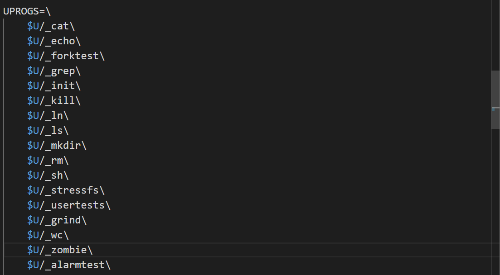

* 在放入***user/user.h***声明，如下所示：
  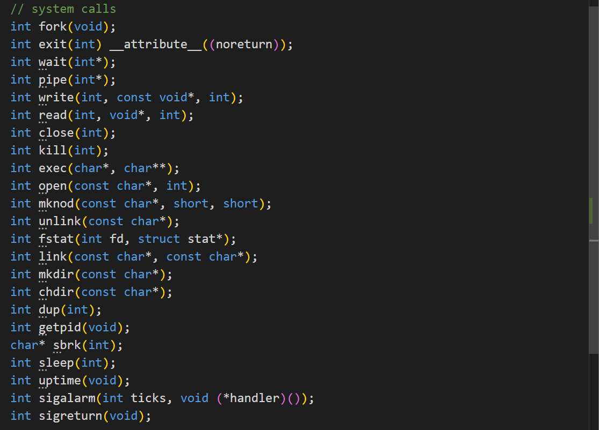

  更新***user/usys.pl***、***kernel/syscall.h***和***kernel/syscall.c***添加`sigalarm`和`sigreturn`系统调用，如下：
  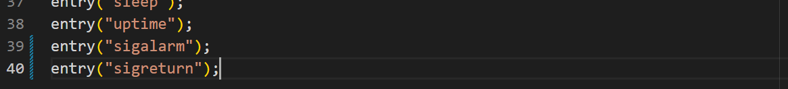
  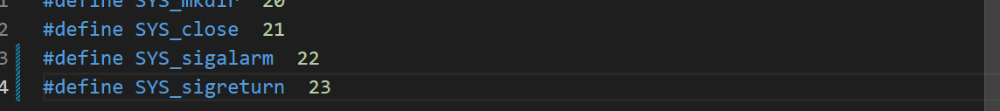
  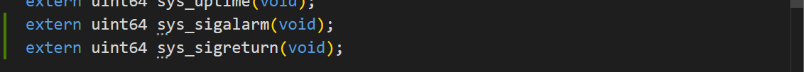
  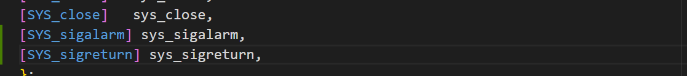

* 在***kernel/sysproc***中定义上述的两个函数，让其先返回0，如下所示：
  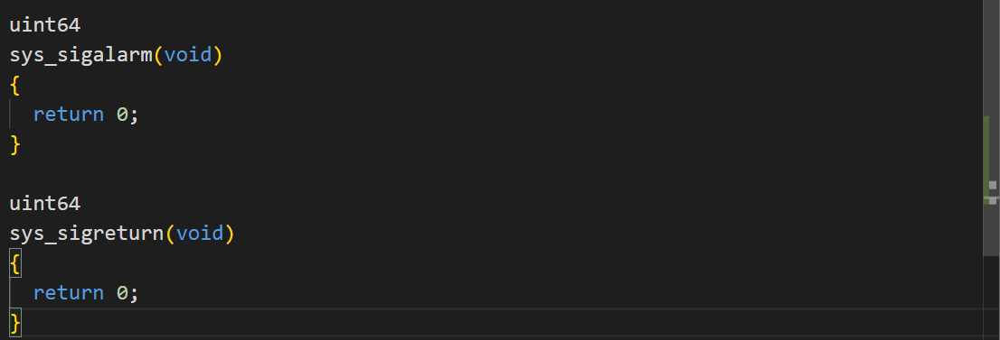

* 在`struct proc`中增加字段，同时记得在`allocproc`中将它们初始化为0，并在`freeproc`中也设为0：

  ```
  int alarm_interval;          // 报警间隔
  void (*alarm_handler)();     // 报警处理函数
  int ticks_count;             // 两次报警间的滴答计数
  ```

  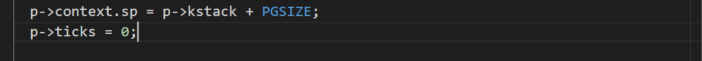

* 按照提示，在`usertrap()`添加代码对计时器中断进行处理：

  ```c
    // give up the CPU if this is a timer interrupt.
    if(which_dev == 2){
      if (p->ticks > 0){
        p->ticks_cnt++;// 计算间隔周期
        if (p->ticks_cnt > p->ticks){
          p->ticks_cnt = 0;
          p->trapframe->epc = p->handler;// 修改下一个指令地址为handler函数
        }
      }
      yield();
    }
  ```

*  在`sys_sigalarm`中读取参数：

  ```c
  uint64
  sys_sigalarm(void)
  {
    int ticks;
    uint64 handler;
    argint(0,&ticks);
    argaddr(0, &handler);
    struct proc *p = myproc();
    p->ticks = ticks;
    p->handler = handler;
    p->ticks_cnt = 0;
    return 0;
  }
  ```

* 进入xv6输入`alarmtest`，成功打印“alarm”，`test0`通过。
  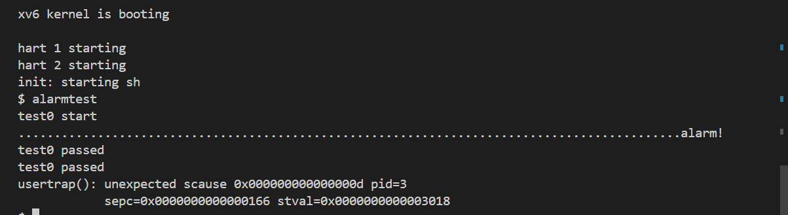

#### 2. test1/test2(): resume interrupted code

* 为了在`usertrap`中再次保存用户寄存器，当`handler`调用`sigreturn`时将其恢复，并且要防止在`handler`执行过程中重复调用，在`struct proc`中新增两个字段：
  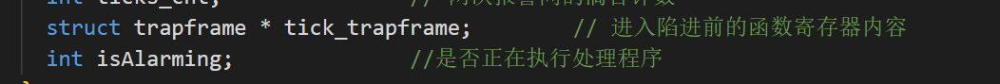

*  在allocproc中设定好相关分配，回收内存的代码：

  ```c
   if((p->tick_trapframe = (struct trapframe*)kalloc()) == 0) {
        freeproc(p);
        release(&p->lock);
        return 0;
    }
    p->isAlarming = 0;
    p->ticks = 0;
    p->handler = 0;
    p->ticks_cnt = 0;
  ```

*  更改usertrap函数，保存进程陷阱帧`p->trapframe`到`p->alarm_trapframe`

  ```c
    // give up the CPU if this is a timer interrupt.
    if(which_dev == 2){
      if (p->ticks > 0){
        p->ticks_cnt++;
        if (p->ticks_cnt > p->ticks && p->isAlarming == 0){
          p->ticks_cnt = 0;
          // 保存寄存器中的内容
          memmove(p->tick_trapframe, p->trapframe, sizeof(struct trapframe));
          p->trapframe->epc = p->handler;
          p->ticks_cnt = 0;
          p->isAlarming = 1;
        }
      }
      yield();
    }
  ```

* 完善`sys_sigreturn`，恢复陷阱帧：

  ```c
  uint64
  sys_sigreturn(void)
  {
    struct proc *p = myproc();
    memmove(p->trapframe, p->tick_trapframe, sizeof(struct trapframe));
    p->isAlarming = 0;
    return 0;
  }
  ```

### 3.运行结果

* 进入xv6，输入`alarmtest`，`test0`~`test2`全部passed，如下：
  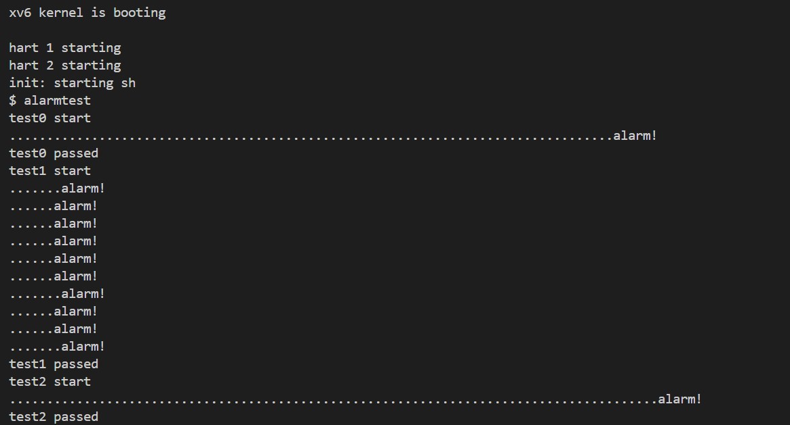

## 实验结果

* 输入命令`/grade-lab-traps `，所有测试通过，分数为85/85，结果如下：
  

