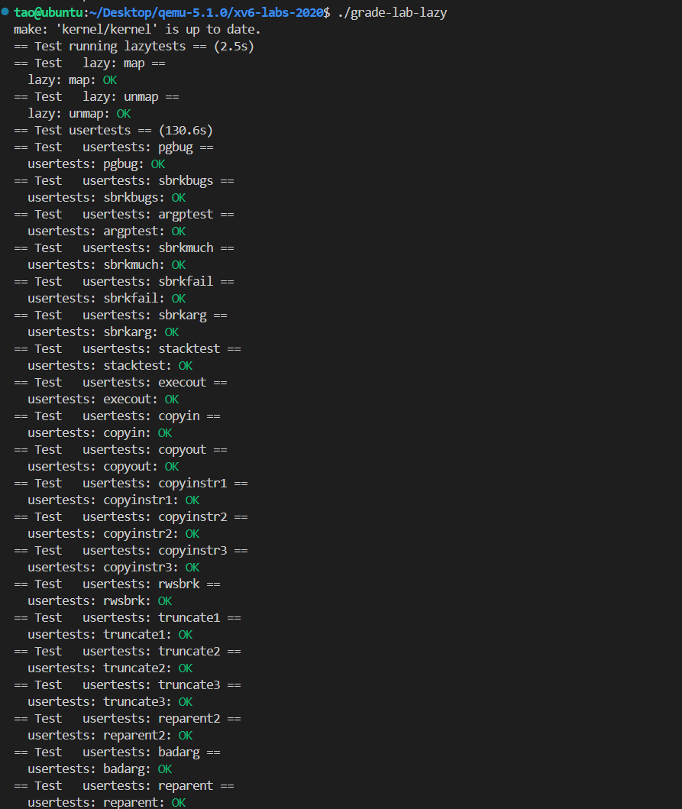

# Lab5: xv6 lazy page allocation

## 1.实验准备

* 操作系统可以使用页表硬件的技巧之一是延迟分配用户空间堆内存（lazy allocation of user-space heap memory）。在本实验中，将向xv6添加这个延迟分配特性。
* ==Attention==

> - 在开始编码之前，请阅读xv6手册的第4章（特别是4.6），以及可能要修改的相关文件：
>   - ***kernel/trap.c***
>   - ***kernel/vm.c***
>   - ***kernel/sysproc.c***

* 切换到`lazy`分支：

  ```c
  $ git fetch
  $ git checkout lazy
  $ make clean
  ```

## Eliminate allocation from sbrk()

### 1. 实验内容

* 你的首项任务是删除`sbrk(n)`系统调用中的页面分配代码（位于***sysproc.c***中的函数`sys_sbrk()`）。`sbrk(n)`系统调用将进程的内存大小增加n个字节，然后返回新分配区域的开始部分（即旧的大小）。新的`sbrk(n)`应该只将进程的大小（`myproc()->sz`）增加n，然后返回旧的大小。它不应该分配内存——因此您应该删除对`growproc()`的调用（但是您仍然需要增加进程的大小！）。


### 2.实验步骤及代码

* 按照提示对sbrk()进行修改，让其只增加进程的大小部分，并不实际申请新的内存，代码如下：

  ```c
  uint64
  sys_sbrk(void)
  {
    int addr;
    int n;
  
    if(argint(0, &n) < 0)
      return -1;
    addr = myproc()->sz;
    // if(growproc(n) < 0)
    //   return -1;
    //lazy allocation
    myproc()->sz += n;
    return addr;
  }
  ```

### 3.运行结果

* 启动xv6，在shell中键入`echo hi`，输出与实验手册一致：
  


## Lazy allocation

### 1.实验内容

* 修改***trap.c***中的代码以响应来自用户空间的页面错误，方法是新分配一个物理页面并映射到发生错误的地址，然后返回到用户空间，让进程继续执行。您应该在生成“`usertrap(): …`”消息的`printf`调用之前添加代码。你可以修改任何其他xv6内核代码，以使`echo hi`正常工作。

### 2.实验步骤及代码

* 修改`usertrap()`函数，使用`r_scause()`判断是否为页面错误，在页面错误处理的过程中，先判断发生错误的虚拟地址（`r_stval()`读取）是否位于栈空间之上，如果是lazy allocation，就进行对应页面分配，代码如下：

  ```c
  if (r_scause() == 13 || r_scause() == 15){ //判断是否是页面错误
      uint64 va = r_stval(); // 接受页面错误地址
      // 如果是lazy allocation引起的页面错误，对其进行页面分配
      if(is_lazy_alloc_va(va)){
        if(lazy_alloc(va) < 0){
  		printf("lazy_alloc fail!\n");
            p->killed = 1;
        }
      }
    }
  ```

* 在***kernel/proc.c***中，添加`is_lazy_alloc_va()`和`lazy_alloc()`函数，代码如下：

  ```c
  int
  is_lazy_alloc_va(uint64 va)
  {
    struct proc *p = myproc();
    // 判断是否超出进程空间
    if (va >= p->sz)return 0;
    return 1;
  }
  
  int
  lazy_alloc(uint64 va)
  {
   va = PGROUNDDOWN(va);
   char *mem = kalloc();
   if (mem == 0)return -1;
   memset(mem,0,PGSIZE);
   struct proc *p = myproc();
   if (mappages(p->pagetable,va,PGSIZE, (uint64)mem, PTE_W|PTE_X|PTE_R|PTE_U) != 0){
    kfree(mem);
    return -1;
   } 
   return 0;
  }
  
  ```

* 然后在`defs.h`中注册这两个函数：
  

### 3.运行结果

* 启动xv6，能够正常运行`echo hi`，但因为延迟分配可能会有一个页面错误，如下所示：
  

* 修改`uvmunmap()`(***kernel/vm.c***)，lazy allocation中首先并未实际分配内存，所以当解除映射关系的时候对于这部分内存要略过，而不是使系统崩溃，结果如下：
  

## Lazytest and Usertests

### 1.实验内容

* 我们为您提供了`lazytests`，这是一个xv6用户程序，它测试一些可能会给您的惰性内存分配器带来压力的特定情况。修改内核代码，使所有`lazytests`和`usertests`都通过。

### 2.实验步骤及代码

* 处理`sbrk()`中参数为负的情况，当参数为负时，接触对应部分的映射：

  ```c
  uint64
  sys_sbrk(void)
  {
    int addr;
    int n;
  
    if(argint(0, &n) < 0)
      return -1;
    addr = myproc()->sz;
    // if(growproc(n) < 0)
    //   return -1;
    //lazy allocation
    if (n > 0)myproc()->sz += n;
    else {
      if (myproc()->sz + n < 0)return -1;
      // 处理sbrk()参数为负数的情况
      else {
        myproc()->sz = uvmdealloc(myproc()->pagetable, myproc()->sz, myproc()->sz + n);
      }
    }
    return addr;
  }
  ```

* 处理某个进程在高于`sbrk()`分配的任何虚拟内存地址上出现页错误，则终止该进程。在原来的`lazy_alloc_va()`函数中已经做过处理。

* 处理`fork()`中父到子内存的拷贝，在拷贝过程可能会遇到lazy alloc，需要跳过这部分内存的拷贝，在`uvmcopy()`函数中跳过这些处理，如下：
  

* 处理进程从`sbrk()`向系统调用（如`read`或`write`）传递有效地址，但尚未分配该地址的内存，由于这些函数都是由于`walkaddr()`函数调用导致，对该函数进行修改，对lazy alloc导致的无效地址进行特殊处理，如下：

  ```c
  uint64
  walkaddr(pagetable_t pagetable, uint64 va)
  {
    pte_t *pte;
    uint64 pa;
  
    if(va >= MAXVA)
      return 0;
  
    pte = walk(pagetable, va, 0);
    if(pte == 0 || (*pte & PTE_V) == 0 || (*pte & PTE_U) == 0 || (*pte & PTE_U) == 0){
      // 判断是否时lazy alloc
      if (is_lazy_alloc_va(va)){
        if (lazy_alloc(va) < 0){
          return 0;
        }
        return walkaddr(pagetable, va);
      }
      return 0;
    }
  
    pa = PTE2PA(*pte);
    return pa;
  }
  
  ```

  

* 处理用户栈下面无效的页面（guard page），进行判断如果访问该页面则不进行lazy alloc，如下所示：

  ```c
  int
  is_lazy_alloc_va(uint64 va)
  {
    struct proc *p = myproc();
    // 判断是否超出进程空间
    if (va >= p->sz)return 0;
    // va试图访问guardpage
    if (va < PGROUNDDOWN(p->trapframe->sp) && va >=PGROUNDDOWN(p->trapframe->sp) - PGSIZE){
      return 0;
    }
    return 1;
  }
  ```

### 3.实验结果

* 启动xv6，进行`lazytests`，测验通过结果如下：
  
* 进行`usertests`，测验通过结果如下：
  

## 实验结果

* 启动xv6，进行lab 5实验测试，测试全部通过，分数为，结果如下：
  
  