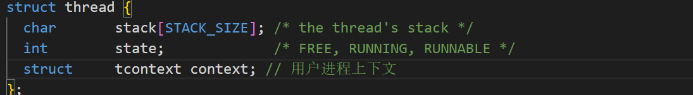
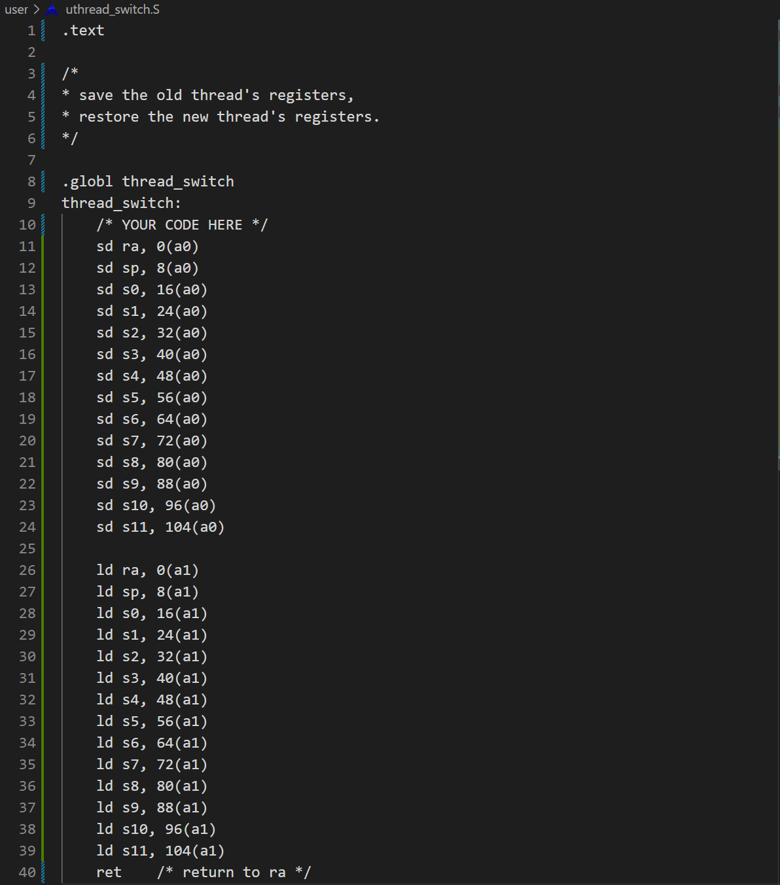
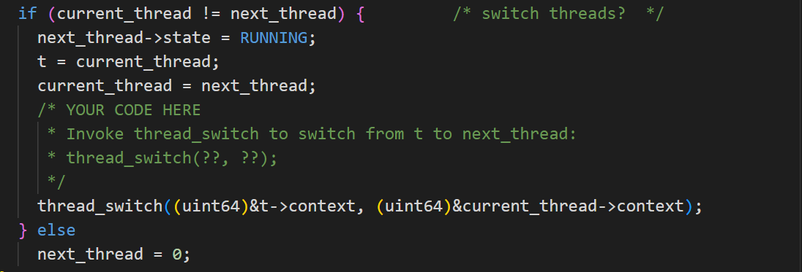
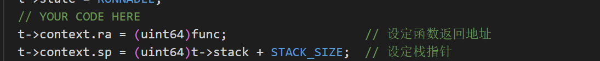
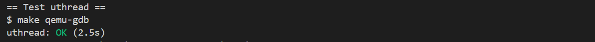
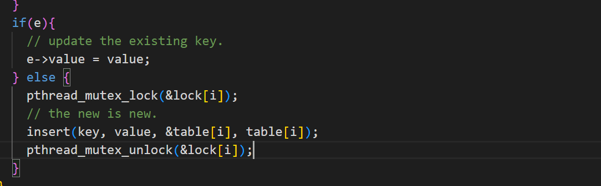
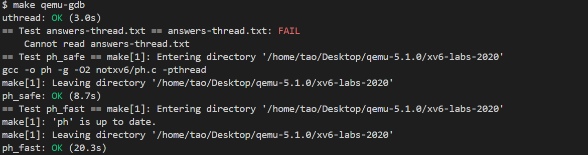
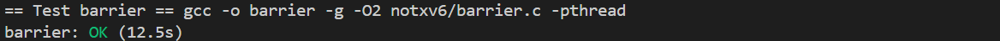
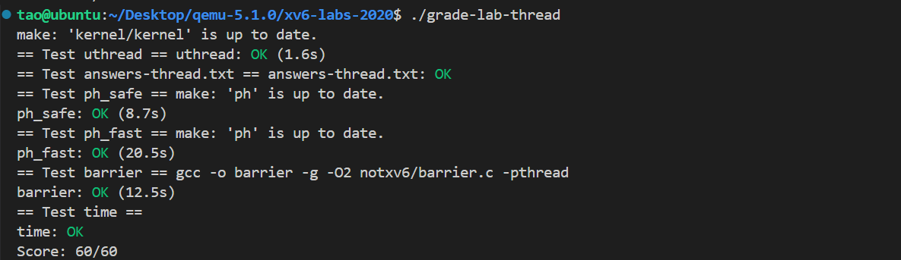

# Lab7:  Multithreading

## 1.实验准备

* 本实验将使您熟悉多线程。您将在用户级线程包中实现线程之间的切换，使用多个线程来加速程序，并实现一个屏障

* 切换到`thread`分支：

  ```c
  $ git fetch
  $ git checkout thread
  $ make clean
  ```

##  Uthread: switching between threads

### 1. 实验内容

* 您的工作是提出一个创建线程和保存/恢复寄存器以在线程之间切换的计划（为用户及线程系统设计上下文切换机制），并实现该计划。完成后，`make grade`应该表明您的解决方案通过了`uthread`测试。


### 2.实验步骤及代码

* 首先在***user/uthread.c***中定义一个存储上下文的结构体`context`，如下：
  
  ```c
  // 用户线程的上下文结构体
  struct tcontext {
    uint64 ra;
    uint64 sp;
  
    // callee-saved
    uint64 s0;
    uint64 s1;
    uint64 s2;
    uint64 s3;
    uint64 s4;
    uint64 s5;
    uint64 s6;
    uint64 s7;
    uint64 s8;
    uint64 s9;
    uint64 s10;
    uint64 s11;
  };
  ```
  
* 修改`thread`结构体，添加`context`字段：
  

* 将***kernel/switch.S***里用来保存寄存器状态的汇编代码原封不动的搬到***user/uthread_switch.S***里，如下：
  

* 修改`thread_scheduler`，添加线程切换语句：

  

* 修改`thread_create`中对`thread`结构体做一些初始化设定：
  

### 3.运行结果

* 启动xv6，运行uthread测试，结果如下所示：
  
  
  成功通过uthread测试。

##  Using threads

### 1.实验内容

* 为什么两个线程都丢失了键，而不是一个线程？确定可能导致键丢失的具有2个线程的事件序列。在***answers-thread.txt***中提交您的序列和简短解释。

  [!TIP] 为了避免这种事件序列，请在***notxv6/ph.c***中的`put`和`get`中插入`lock`和`unlock`语句，以便在两个线程中丢失的键数始终为0。相关的pthread调用包括：

  - `pthread_mutex_t lock; // declare a lock`
  - `pthread_mutex_init(&lock, NULL); // initialize the lock`
  - `pthread_mutex_lock(&lock); // acquire lock`
  - `pthread_mutex_unlock(&lock); // release lock`

  当`make grade`说您的代码通过`ph_safe`测试时，您就完成了，该测试需要两个线程的键缺失数为0。在此时，`ph_fast`测试失败是正常的。

* 修改代码，使某些`put`操作在保持正确性的同时并行运行。当`make grade`说你的代码通过了`ph_safe`和`ph_fast`测试时，你就完成了。`ph_fast`测试要求两个线程每秒产生的`put`数至少是一个线程的1.25倍。

### 2.实验步骤及代码

* 数据丢失的原因：

  > 假设现在有两个线程T1和T2，两个线程都走到put函数，且假设两个线程中key%NBUCKET相等，即要插入同一个散列桶中。两个线程同时调用insert(key, value, &table[i], table[i])，insert是通过头插法实现的。如果先insert的线程还未返回另一个线程就开始insert，那么前面的数据会被覆盖。

* 为了防止数据丢失，对插入操作上锁，避免产生冲突：

  1. 为每个散列桶定义一个锁，将五个锁放在一个数组中，并进行初始化

     ```c
     pthread_mutex_t lock[NBUCKET] = { PTHREAD_MUTEX_INITIALIZER }; // 每个散列桶一把锁
     ```

  2. 在`put`函数中对`insert`上锁：

     

### 3.运行结果

* 启动xv6，运行`ph_safe`和`ph_fast`:
  

  测试均通过。

## Barrier

### 1.实验内容

* 您的目标是实现期望的屏障行为。除了在`ph`作业中看到的lock原语外，还需要以下新的pthread原语：
  - `// 在cond上进入睡眠，释放锁mutex，在醒来时重新获取`
  - `pthread_cond_wait(&cond, &mutex);`
  - `// 唤醒睡在cond的所有线程`
  - `pthread_cond_broadcast(&cond);`

### 2.实验步骤及代码

* 代码如下：

  ```c
  static void 
  barrier()
  {
    // 申请持有锁
    pthread_mutex_lock(&bstate.barrier_mutex);
  
    bstate.nthread++;
    if(bstate.nthread == nthread) {
      // 所有线程已到达
      bstate.round++;
      bstate.nthread = 0;
      pthread_cond_broadcast(&bstate.barrier_cond);
    } else {
      // 等待其他线程
      // 调用pthread_cond_wait时，mutex必须已经持有
      pthread_cond_wait(&bstate.barrier_cond, &bstate.barrier_mutex);
    }
    // 释放锁
    pthread_mutex_unlock(&bstate.barrier_mutex);
  }
  ```

### 3.运行结果

* 启动xv6，运行`make grade`的`barrier`测试。结果如下：
  

## 实验结果

* 启动xv6，输入命令`./grade-lab-thread `运行测试，所有测试通过，分数为60/60，如下所示：
  

