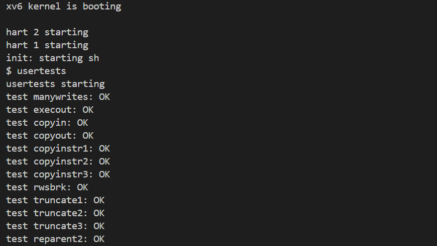
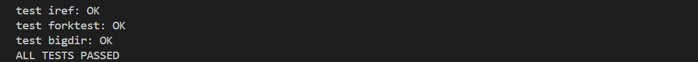
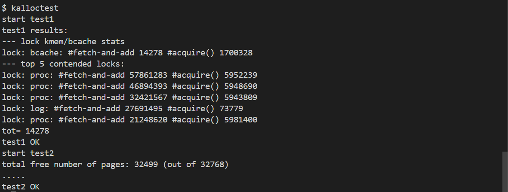
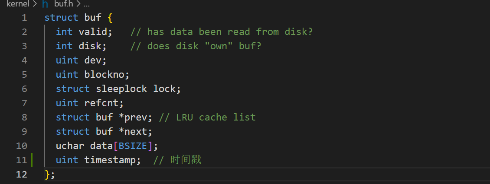
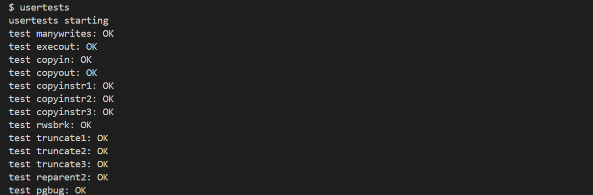
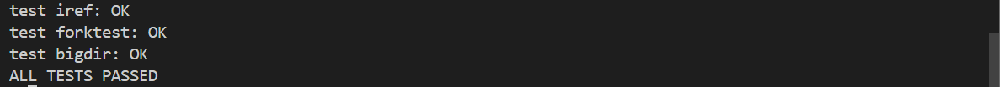
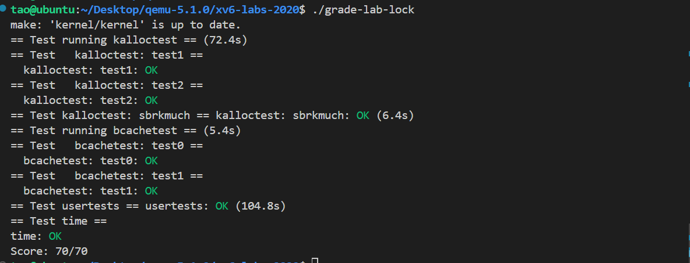

# Lab8: locks

## 1.实验准备

* 在本实验中，您将获得重新设计代码以提高并行性的经验。多核机器上并行性差的一个常见症状是频繁的锁争用。提高并行性通常涉及更改数据结构和锁定策略以减少争用。您将对xv6内存分配器和块缓存执行此操作。

* 切换到`lock`分支：

  ```c
  $ git fetch
  $ git checkout lock
  $ make clean
  ```

## Memory allocator

### 1. 实验内容

* 您的工作是实现每个CPU的空闲列表，并在CPU的空闲列表为空时进行窃取。所有锁的命名必须以“`kmem`”开头。也就是说，您应该为每个锁调用`initlock`，并传递一个以“`kmem`”开头的名称。运行`kalloctest`以查看您的实现是否减少了锁争用。要检查它是否仍然可以分配所有内存，请运行`usertests sbrkmuch`。您的输出将与下面所示的类似，在`kmem`锁上的争用总数将大大减少，尽管具体的数字会有所不同。确保`usertests`中的所有测试都通过。评分应该表明考试通过。


### 2.实验步骤及代码

* 改写数据结构, 使得每一CPU都有一个`freelist`，其中NCPU是整个系统的CPU个数：

  ```c
  struct {
    struct spinlock lock;
    struct run *freelist;
  } kmem[NCPU];
  ```

* 接着修改`kinit()`，为所有锁初始化以“kmem”开头的名称，一个CPU只能被一个该函数调用，`freerange`调用`kfree`将所有空闲内存挂在该CPU的空闲列表上：

  ```c
  void
  kinit()
  {
    char lockname[8];
    for(int i = 0;i < NCPU; i++) {
      snprintf(lockname, sizeof(lockname), "kmem_%d", i);
      initlock(&kmem[i].lock, lockname);
    }
    freerange(end, (void*)PHYSTOP);
  }
  
  ```

* 为了防止在调用`kalloc()`和`kfree()`时该段代码切换到其他的CPU上运行，需要先关闭interrupt中断：

  ```c
  void
  kfree(void *pa)
  {
    struct run *r;
  
    if(((uint64)pa % PGSIZE) != 0 || (char*)pa < end || (uint64)pa >= PHYSTOP)
      panic("kfree");
  
    // Fill with junk to catch dangling refs.
    memset(pa, 1, PGSIZE);
  
    r = (struct run*)pa;
  
    push_off();  // 关中断
    int id = cpuid();
    acquire(&kmem[id].lock);
    r->next = kmem[id].freelist;
    kmem[id].freelist = r;
    release(&kmem[id].lock);
    pop_off();  //开中断
  }
  ```

  ```c
  void *
  kalloc(void)
  {
    struct run *r;
  
    push_off();// 关中断
    int id = cpuid();
    acquire(&kmem[id].lock);
    r = kmem[id].freelist;
    if(r)
      kmem[id].freelist = r->next;
    else {
      int antid;  // another id
      // 遍历所有CPU的空闲列表
      for(antid = 0; antid < NCPU; ++antid) {
        if(antid == id)
          continue;
        acquire(&kmem[antid].lock);
        r = kmem[antid].freelist;
        if(r) {
          kmem[antid].freelist = r->next;
          release(&kmem[antid].lock);
          break;
        }
        release(&kmem[antid].lock);
      }
    }
    release(&kmem[id].lock);
    pop_off();  //开中断
  
    if(r)
      memset((char*)r, 5, PGSIZE); // fill with junk
    return (void*)r;
  }
  ```

### 3.运行结果

* 启动xv6，运行`usertests`，查看对应测试是否通过，结果如下：

  `usertest`和`kalloctests`都全部通过。
  

## Buffer cache

### 1.实验内容

* 修改块缓存，以便在运行`bcachetest`时，bcache（buffer cache的缩写）中所有锁的`acquire`循环迭代次数接近于零。理想情况下，块缓存中涉及的所有锁的计数总和应为零，但只要总和小于500就可以。修改`bget`和`brelse`，以便bcache中不同块的并发查找和释放不太可能在锁上发生冲突（例如，不必全部等待`bcache.lock`）。你必须保护每个块最多缓存一个副本的不变量。完成后，您的输出应该与下面显示的类似（尽管不完全相同）。确保`usertests`仍然通过。完成后，`make grade`应该通过所有测试。

### 2.实验步骤及代码

* 定义哈希桶结构，并在`bcache`中删除全局缓冲区链表，改为使用素数个散列桶：

  ```c
  #define NBUCKET 13
  #define HASH(id) (id % NBUCKET)
  
  struct hashbuf {
    struct buf head;       // 头节点
    struct spinlock lock;  // 锁
  };
  
  struct {
    struct buf buf[NBUF];
    struct hashbuf buckets[NBUCKET];  // 散列桶
  } bcache;
  ```

* 修改`binit()`函数，初始化散列桶的锁，将所有散列桶的`head->prev`、`head->next`都指向自身表示为空，将所有的缓冲区挂载到`bucket[0]`桶上，代码如下：

  ```c
  void
  binit(void) {
    struct buf* b;
    char lockname[16];
  
    for(int i = 0; i < NBUCKET; ++i) {
      // 初始化散列桶的自旋锁
      snprintf(lockname, sizeof(lockname), "bcache_%d", i);
      initlock(&bcache.buckets[i].lock, lockname);
  
      // 初始化散列桶的头节点
      bcache.buckets[i].head.prev = &bcache.buckets[i].head;
      bcache.buckets[i].head.next = &bcache.buckets[i].head;
    }
  
    // Create linked list of buffers
    for(b = bcache.buf; b < bcache.buf + NBUF; b++) {
      // 利用头插法初始化缓冲区列表,全部放到散列桶0上
      b->next = bcache.buckets[0].head.next;
      b->prev = &bcache.buckets[0].head;
      initsleeplock(&b->lock, "buffer");
      bcache.buckets[0].head.next->prev = b;
      bcache.buckets[0].head.next = b;
    }
  }
  ```

* 在***buf.h***中增加新字段`timestamp`，用于作为LRU判定的依据，不用再进行头插法更改节点位置：
  

* 更改`brelse`，不再获取全局锁：

  ```c
  void
  brelse(struct buf* b) {
    if(!holdingsleep(&b->lock))
      panic("brelse");
  
    int bid = HASH(b->blockno);
  
    releasesleep(&b->lock);
  
    acquire(&bcache.buckets[bid].lock);
    b->refcnt--;
  
    // 更新时间戳
    // 由于LRU改为使用时间戳判定，不再需要头插法
    acquire(&tickslock);
    b->timestamp = ticks;
    release(&tickslock);
  
    release(&bcache.buckets[bid].lock);
  }
  ```

* 更改`bget`，如果没有找到对应的缓冲区进行分配，优先从当前的列表进行遍历，找出没有被引用且时间戳最小的缓冲区，如果还是没有找到，就申请下一个桶的锁，做同样的操作。

```c
static struct buf*
bget(uint dev, uint blockno) {
  struct buf* b;

  int bid = HASH(blockno);
  acquire(&bcache.buckets[bid].lock);

  // Is the block already cached?
  for(b = bcache.buckets[bid].head.next; b != &bcache.buckets[bid].head; b = b->next) {
    if(b->dev == dev && b->blockno == blockno) {
      b->refcnt++;

      // 记录使用时间戳
      acquire(&tickslock);
      b->timestamp = ticks;
      release(&tickslock);

      release(&bcache.buckets[bid].lock);
      acquiresleep(&b->lock);
      return b;
    }
  }

  // Not cached.
  b = 0;
  struct buf* tmp;

  // Recycle the least recently used (LRU) unused buffer.
  // 从当前散列桶开始查找
  for(int i = bid, cycle = 0; cycle != NBUCKET; i = (i + 1) % NBUCKET) {
    ++cycle;
    // 如果遍历到当前散列桶，则不重新获取锁
    if(i != bid) {
      if(!holding(&bcache.buckets[i].lock))
        acquire(&bcache.buckets[i].lock);
      else
        continue;
    }

    for(tmp = bcache.buckets[i].head.next; tmp != &bcache.buckets[i].head; tmp = tmp->next)
      // 使用时间戳进行LRU算法，而不是根据结点在链表中的位置
      if(tmp->refcnt == 0 && (b == 0 || tmp->timestamp < b->timestamp))
        b = tmp;

    if(b) {
      // 如果是从其他散列桶窃取的，则将其以头插法插入到当前桶
      if(i != bid) {
        b->next->prev = b->prev;
        b->prev->next = b->next;
        release(&bcache.buckets[i].lock);

        b->next = bcache.buckets[bid].head.next;
        b->prev = &bcache.buckets[bid].head;
        bcache.buckets[bid].head.next->prev = b;
        bcache.buckets[bid].head.next = b;
      }

      b->dev = dev;
      b->blockno = blockno;
      b->valid = 0;
      b->refcnt = 1;

      acquire(&tickslock);
      b->timestamp = ticks;
      release(&tickslock);

      release(&bcache.buckets[bid].lock);
      acquiresleep(&b->lock);
      return b;
    } else {
      // 在当前散列桶中未找到，则直接释放锁
      if(i != bid)
        release(&bcache.buckets[i].lock);
    }
  }

  panic("bget: no buffers");
}
```

* 修改`bpin()`和`bunpin()`：

  ```c
  void
  bpin(struct buf* b) {
    int bid = HASH(b->blockno);
    acquire(&bcache.buckets[bid].lock);
    b->refcnt++;
    release(&bcache.buckets[bid].lock);
  }
  
  void
  bunpin(struct buf* b) {
    int bid = HASH(b->blockno);
    acquire(&bcache.buckets[bid].lock);
    b->refcnt--;
    release(&bcache.buckets[bid].lock);
  }
  ```

### 3.运行结果

* 启动xv6，运行`usertests`测试，结果和上一个实验一致，依旧全部通过：
  

  

## 实验结果

* 启动xv6，输入命令`./grade-lab-locks `运行测试，所有测试通过，分数为70/70，如下所示：
  

