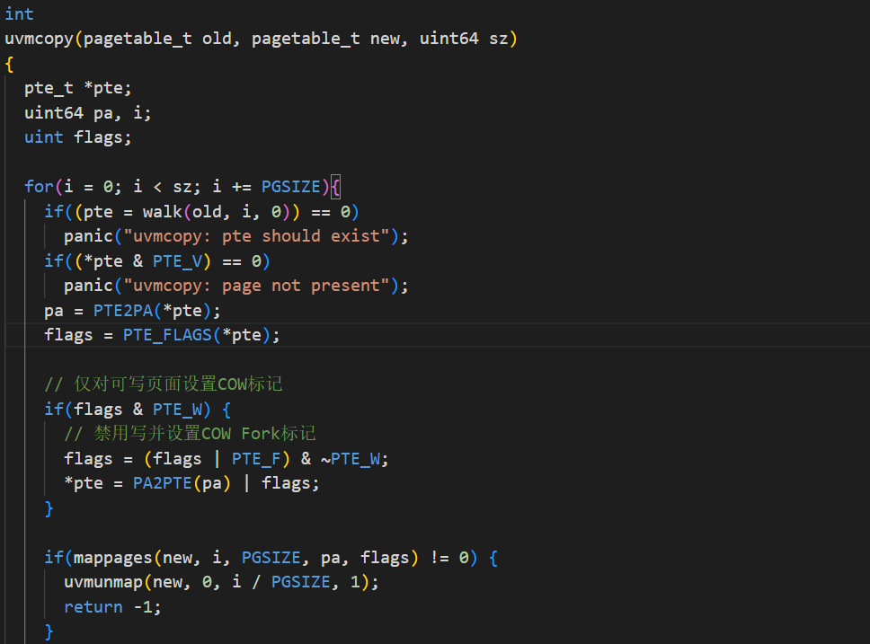
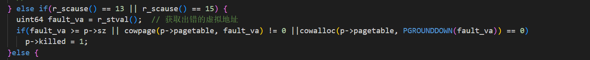
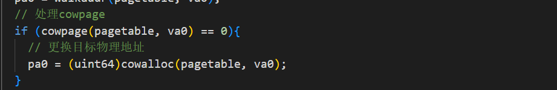
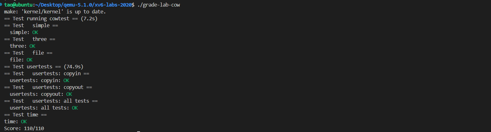

# Lab6: Copy-on-Write Fork for xv6

## 1.实验准备

* 虚拟内存提供了一定程度的间接寻址：内核可以通过将PTE标记为无效或只读来拦截内存引用，从而导致页面错误，还可以通过修改PTE来更改地址的含义。在计算机系统中有一种说法，任何系统问题都可以用某种程度的抽象方法来解决。Lazy allocation实验中提供了一个例子。这个实验探索了另一个例子：写时复制分支（copy-on write fork）。

* 切换到`cow`分支：

  ```c
  $ git fetch
  $ git checkout cow
  $ make clean
  ```

* 问题：

  > xv6中的`fork()`系统调用将父进程的所有用户空间内存复制到子进程中。如果父进程较大，则复制可能需要很长时间。更糟糕的是，这项工作经常造成大量浪费；例如，子进程中的`fork()`后跟`exec()`将导致子进程丢弃复制的内存，而其中的大部分可能都从未使用过。另一方面，如果父子进程都使用一个页面，并且其中一个或两个对该页面有写操作，则确实需要复制。

* 解决方案：

  > copy-on-write (COW) fork()的目标是推迟到子进程实际需要物理内存拷贝时再进行分配和复制物理内存页面。
  >
  > COW fork()只为子进程创建一个页表，用户内存的PTE指向父进程的物理页。COW fork()将父进程和子进程中的所有用户PTE标记为不可写。当任一进程试图写入其中一个COW页时，CPU将强制产生页面错误。内核页面错误处理程序检测到这种情况将为出错进程分配一页物理内存，将原始页复制到新页中，并修改出错进程中的相关PTE指向新的页面，将PTE标记为可写。当页面错误处理程序返回时，用户进程将能够写入其页面副本。
  >
  > COW fork()将使得释放用户内存的物理页面变得更加棘手。给定的物理页可能会被多个进程的页表引用，并且只有在最后一个引用消失时才应该被释放。

## Implement copy-on write

### 1. 实验内容

* 您的任务是在xv6内核中实现copy-on-write fork。如果修改后的内核同时成功执行`cowtest`和`usertests`程序就完成了


### 2.实验步骤及代码

* 修改`uvmcopy()`将父进程的物理页映射到子进程，而不是分配新页。在子进程和父进程的PTE中清除`PTE_W`标志。
  
* 修改`usertrap()`以识别页面错误。当COW页面出现页面错误时，使用`kalloc()`分配一个新页面，并将旧页面复制到新页面，然后将新页面添加到PTE中并设置`PTE_W`。
  其中`cowpage()`函数用来判断发生错误的页面是否为cowpage，代码如下：
  
  ```c
   // 判断一个页面是否为COW页面
  int cowpage(pagetable_t pagetable, uint64 va) {
    if(va >= MAXVA)
      return -1;
    pte_t* pte = walk(pagetable, va, 0);
    if(pte == 0)
      return -1;
    if((*pte & PTE_V) == 0)
      return -1;
    return (*pte & PTE_F ? 0 : -1);
  }
  ```
  
  `cowalloc()`函数用于为cowpage分配新的页面，代码如下：
  
  ```c
  // 为cowpage分配
  void* cowalloc(pagetable_t pagetable, uint64 va) {
    if(va % PGSIZE != 0)
      return 0;
  
    uint64 pa = walkaddr(pagetable, va);  // 获取对应的物理地址
    if(pa == 0)
      return 0;
  
    pte_t* pte = walk(pagetable, va, 0);  // 获取对应的PTE
  
    if(krefcnt((char*)pa) == 1) {
      // 只剩一个进程对此物理地址存在引用
      // 则直接修改对应的PTE即可
      *pte |= PTE_W;
      *pte &= ~PTE_F;
      return (void*)pa;
    } else {
      // 多个进程对物理内存存在引用
      // 需要分配新的页面，并拷贝旧页面的内容
      char* mem = kalloc();
      if(mem == 0)
        return 0;
  
      // 复制旧页面内容到新页
      memmove(mem, (char*)pa, PGSIZE);
  
      // 清除PTE_V，否则在mappagges中会判定为remap
      *pte &= ~PTE_V;
  
      // 为新页面添加映射
      if(mappages(pagetable, va, PGSIZE, (uint64)mem, (PTE_FLAGS(*pte) | PTE_W) & ~PTE_F) != 0) {
        kfree(mem);
        *pte |= PTE_V;
        return 0;
      }
  
      // 将原来的物理内存引用计数减1
      kfree((char*)PGROUNDDOWN(pa));
      return mem;
    }
  }
  ```
  
* 设计一个数组对每个物理页的引用进行计数，用来判断是否释放，同时修改`uvmcopy()`使其调用`kaddrefcnt()`增加引用计数如下：

  ```c
  struct ref_stru {
    struct spinlock lock;
    int cnt[PHYSTOP / PGSIZE];  // 引用计数
  } ref;
  ```

  ```c
  // 增加内存的引用计数
  int kaddrefcnt(void* pa) {
    if(((uint64)pa % PGSIZE) != 0 || (char*)pa < end || (uint64)pa >= PHYSTOP)
      return -1;
    acquire(&ref.lock);
    ++ref.cnt[(uint64)pa / PGSIZE];
    release(&ref.lock);
    return 0;
  }
  ```
* 修改`copyout()`在遇到COW页面时使用与页面错误相同的方案，如下：
  

## 3.实验结果

* 启动xv6，运行实验测试，所有测试通过，分数为110/110，如下所示：
  